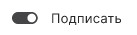

Перейти в мастер **Подписи и шифрования** вы можете из раздела  **Документы**.

Вы можете подписать любые произвольные документы, загрузив их с помощью drag-and-drop, либо выбрать файлы из раздела **Архив**.

#  Как подписать документ, используя профиль подписи

1. Перейдите в раздел **Документы**.
2. Выберите в списке документы, которые нужно подписать, или ничего не выбирайте, если хотите добавить документы из системы.
3. Перейдите в мастер **Подписи и шифрования** через левое боковое меню  или с помощью кнопки .
4. Выберите профиль подписи, в котором заданы настройки подписи. 
    При выборе профиля в мастере автоматически заполняются **Настройки операций**, **Сертификат подписи**, каталоги сохранения результатов подписи.
5. При необходимости добавьте документы в список.
6. Нажмите кнопку , которая становится доступна после выбора всех параметров.

#  Как подписать документ, используя настройки операций в мастере, не изменяя выбранного профиля
Если вы хотите изменить параметры подписи, не изменяя настройки в профиле, то воспользуйтесь настройками в открытом мастере.

1. Перейдите в раздел **Документы**.
2. Выберите в списке документы, которые нужно подписать, или ничего не выбирайте, если хотите добавить документы из системы.
3. Перейдите в мастер **Подписи и шифрования** через левое боковое меню  или с помощью кнопки .
4. Включите на верхней панели операцию . В **Настройках операций** становятся доступны параметры подписи.
5. В **Настройках операций** установите параметры подписи (вид, кодировку, стандарт), выберите сертификат подписи и настройте каталоги сохранения подписанных файлов.
6. Для операции подписи можно выбрать только один сертификат из категории **Личные**, у которого есть привязка к закрытому ключу.  Для этого:
   - нажмите на поле **Сертификат подписи**,
   - в развернувшемся списке выберите сертификат.
    Если в списке нет подходящего сертификата, то нажмите **Показать все сертификаты**, и в открывшейся боковой панели выберите нужный сертификат.
7. При необходимости добавьте документы в список.
8. Нажмите кнопку , которая становится доступна после выбора всех параметров.

#  Как подписать документ сертификатом DSS
Подпись сертификатом DSS ничем не отличается от подписи обычным сертификатом, за исключением некоторых шагов. 
1. При выборе сертификата подписи DSS некоторые настройки операции подписи, такие как выбор стандарта подписи и установка штампов времени, недоступны.
2. При нажатии на кнопку  открывается:
- окно для ввода пароля к ключевому контейнеру. Введите пароль. Если пароль не задан, то данный шаг пропускается.
- окно для ввода пароля для аутентификации на сервисе DSS, если для аутентификации задан пароль и время действия токена аутентификации истекло. Введите пароль. Если токен
аутентификации не истек, то данный шаг пропускается.
- окно для подтверждения аутентификации на сервисе DSS, если для аутентификации задан вход по сим карте или по мобильному приложению, и время действия токена 
аутентификации истекло. Подтвердите операцию входа на сервис на устройстве. Если токен аутентификации не истек, то данный шаг пропускается.
- окно ожидания подтверждения операции подписи, если у пользователя в личном кабинете DSS в настройках аутентификации стоит подтверждение операции подписи сим карте или с помощью мобильного приложения. Подтвердите операцию на устройстве.

***Примечание:*** для DSS подписи наличие лицензии на программный продукт КриптоПро CSP необязательно.

На вкладке **Подпись и шифрование** отображаются ход и результаты выполнения операции.

При успешном выполнении операции подписанные файлы сохраняются в заданном каталоге, если выбран каталог для сохранения результатов. Или рядом с исходным файлом, если каталог не задан. Если установлен флаг **Создать копию в Архиве**, то копия подписанных документов сохраняется в специальную папку, документы которой доступны в разделе **Архив** вкладки **Документы**. 
***Важно!*** Если в настройках подписиы выбрана отделенная подпись, то в заданный каталог и в **Архив** кроме файла подписи создается копия исходного файла.

Если какие-то документы не удалось подписать, то опеация считается выполненной с ошибками. Вы можете посмотреть какие файлы подписались успешно, а какие с ошибками. 
Ошибки при операции выводятся как уведомления. Вы можете их посмотерть, нажав на иконку . Для просмотра подробного описания ошибки или отправки в техническую поддержку нажмите  в правой боковой панели списка уведомлений.

**ВОЗМОЖНЫЕ УВЕДОМЛЕНИЯ:**

1. Не удалось открыть файл - добавленные в мастер документы были удалены или по какой то причине доступны, добавлен пустой файл (с нулевым размером).
2. Не удалось подписать файл - ошибка в адресе службы штампов времени, если подпись со штампом или усовершенствованная. Ошибка подключения к  прокси-серверу. 
3. Не удалось подписать файл - ошибки связанные с истекшими лицензиями КриптоПро TSP Client, OCSP Client, КриптоПро CSP.

**ИНСТРУКЦИИ ПО ТЕМЕ:**
1. [Как создать профиль подписи.](docs\v3.0-Beta\004-documents\create-profile.md)
2. [Как переключаться между профилями подписи.](docs\v3.0-Beta\004-documents\select-profile.md)
3. [Как добавить документы в мастер.](docs\v3.0-Beta\004-documents\add-docs.md)
4. [Как выбрать сертификат подписи.](docs\v3.0-Beta\004-documents\select-sign-cert.md)
5. [Как посмотреть уведомления.](docs\v3.0-Beta\007-cryptoarm\notifications.md)
8. [Действия с результатами операций.](docs\v3.0-Beta\004-documents\operations-result.md)
