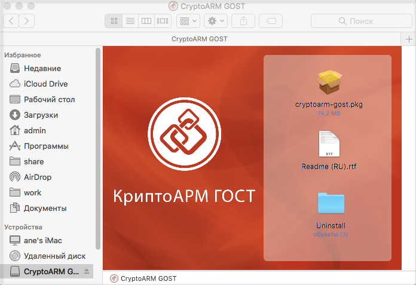
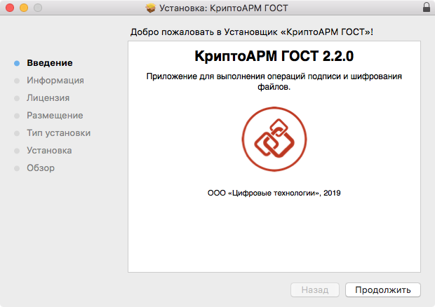
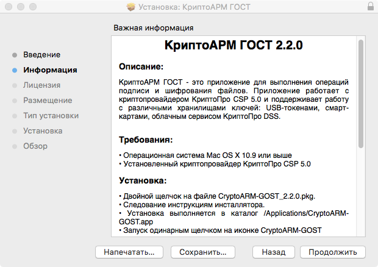
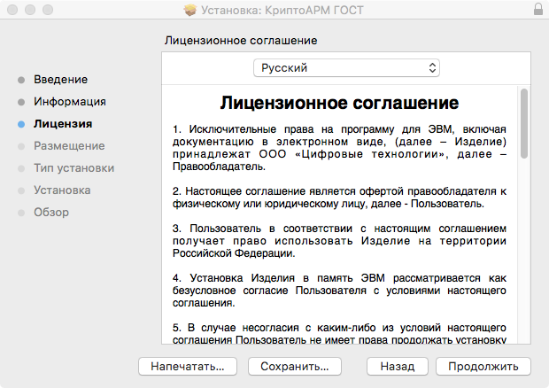
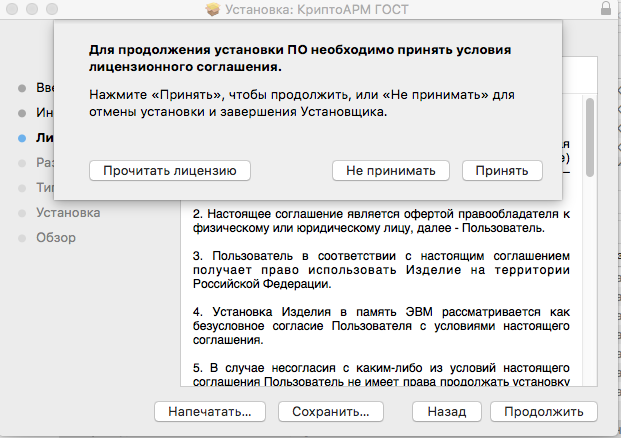
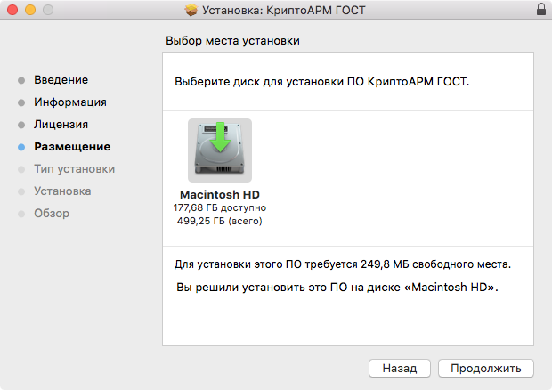
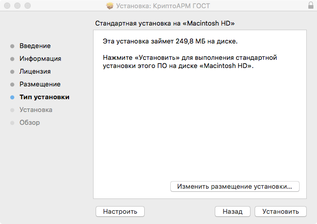

Дистрибутив приложения КриптоАРМ ГОСТ поставляется в упакованном виде, имеет формат .dmg и представляет собой образ диска, содержащий пакет установки **cryptoarm-gost-vx.x.x-x64.pkg,** описание приложения, каталог со скриптами удаления приложения.

Для установки пакета через графический интерфейс откройте двойным щелчком образ диска с дистрибутивом **cryptoarm-gost-vx.x.x-x64.dmg** (где x.x.x – номер версии).

Для установки программы КриптоАРМ ГОСТ запустите на исполнение файл **cryptoarm-gost-vx.x.x-64.pkg** (где x.x.x – номер версии).

Установочный пакет для приложения КриптоАРМ ГОСТ может поставляться вне образа диска. В таком случае нужно сразу запустить файл **cryptoarm-gost-vx.x.x-64.pkg** (где x.x.x – номер версии).

Откроется мастер установки КриптоАРМ ГОСТ. Нажмите кнопку **Продолжить** для продолжения установки. На каждом шаге можно вернуться на предыдущий шаг нажатием **Назад**.

Ознакомьтесь с описание программы и нажмите **Продолжить**. На данном этапе описание можно распечатать или сохранить в файл.

Ознакомьтесь с условиями лицензионного соглашения, нажмите **Продолжить**. На данном этапе лицензионное соглашение можно распечатать или сохранить в файл.

Нажмите кнопку **Принимаю** для продолжения установки приложения или **Не принимаю** для отмены установки.

Выберете диск, на который будет установлено приложение и нажмите **Продолжить**.

На следующем шаге мастера нажмите кнопку **Установить**.

Введите пароль администратора и нажмите **Установить ПО.**

Начнется установка программы на компьютер. По окончании установки нажмите кнопку **Закрыть**.

После установки программы в Launchpad появится ярлык приложения КриптоАРМ ГОСТ и в каталоге Applications (Программы) будут созданы подкаталоги приложения.
