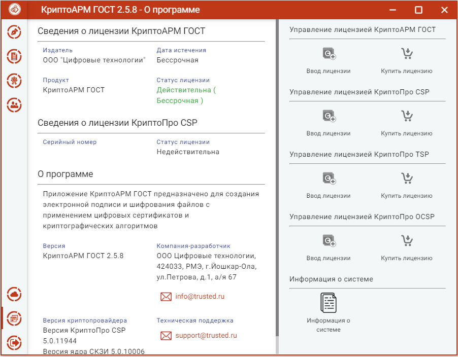
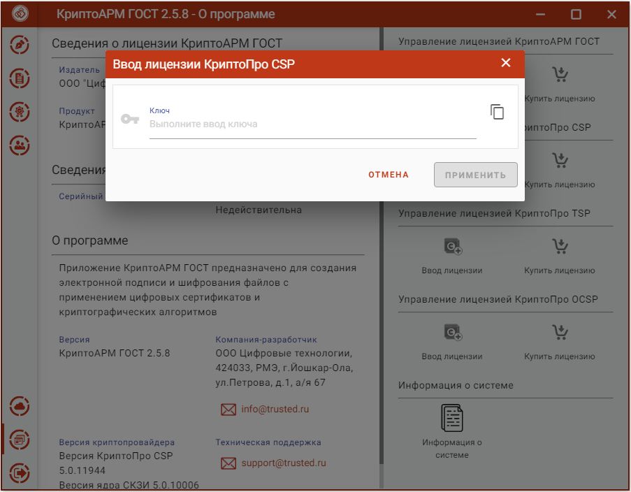
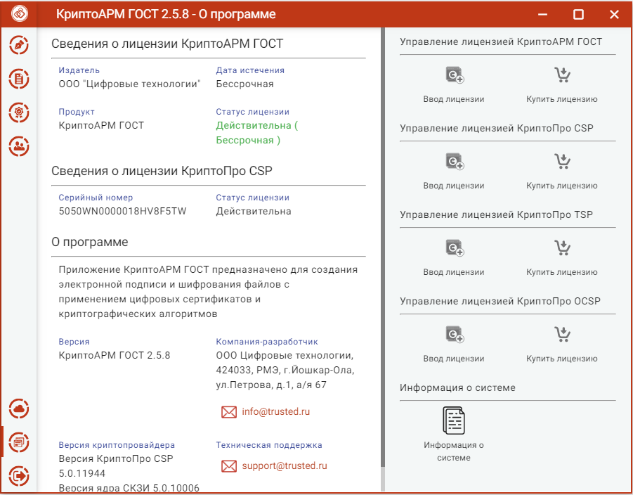

Установка программного обеспечения КриптоПро CSP без ввода лицензии подразумевает использование временной лицензии с ограниченным сроком действия. Для использования КриптоПро CSP после окончания этого срока пользователь должен ввести серийный номер с бланка лицензии, полученной у организации-разработчика или организации, имеющей права распространения продукта (дилера).

Установка лицензионного ключа может производиться как через пользовательский интерфейс приложения КриптоАРМ ГОСТ, так и с помощью консольных команд для ОС linux и MacOS, и через интерфейс программы КриптоПро CSP для ОС Windows. 

Для установки лицензии через пользовательский интерфейс нужно перейти на страницу **О программе** главного меню приложения. На открывшейся странице нажать на кнопку **Ввод лицензии** в разделе управления лицензией КриптоПро CSP.

В результате появляется всплывающее окно ввода лицензии в текстовое поле.

***Примечание:*** При установке лицензии будут запрошены права администратора (Root) на доступ к каталогу установки лицензии.

Если установка лицензионного ключа прошла успешно, то появляется всплывающее сообщение с информацией об этом. На странице **Лицензии** отображается серийный номер и статус лицензии.

В том случае, если лицензия на продукт КриптоПро CSP не введена или не действительна при каждом запуске приложения будет появляться всплывающее сообщение с информацией об этом. 
