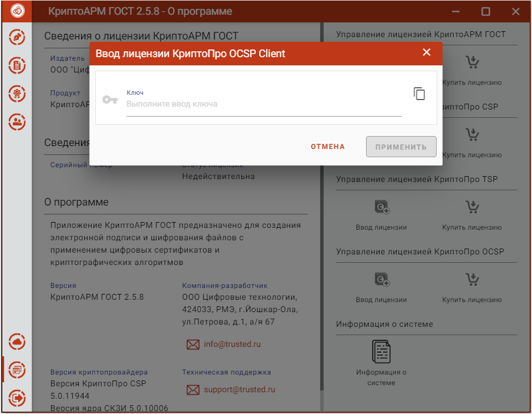

Для создания усовершенствованной подписи необходима установка лицензионного ключа на модули TSP и OCSP.

Установка лицензионного ключа на модуль OCSP может производиться как через пользовательский интерфейс приложения КриптоАРМ ГОСТ, так и с помощью консольных команд для ОС linux и MacOS, и через интерфейс программы КриптоПро CSP для ОС Windows.

Для установки лицензии через пользовательский интерфейс нужно перейти на страницу **Лицензии** через пункт **О программе** главного меню приложения. На открывшейся странице нажать на кнопку **Установить лицензию** в разделе управления лицензией модуля OCSP.

***Примечание:*** Если модуль OCSP не установлен, то кнопка **Ввода лицензии** будет недоступна.

В результате должно появиться всплывающее окно ввода лицензии копированием содержимого файла лицензии в текстовое поле.

***Примечание:*** При установке лицензии будут запрошены права администратора (Root) на доступ к каталогу установки лицензии.

При успешной операции должно появиться информационное сообщение.
