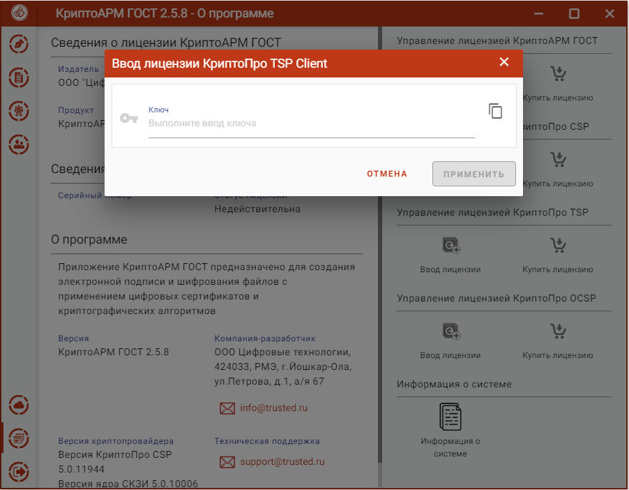

Для создания подписи со штампом времени на подпись или данные необходима лицензия на модуль TSP.

Установка лицензионного ключа может производиться как через пользовательский интерфейс приложения КриптоАРМ ГОСТ, так и с помощью консольных команд для ОС linux и MacOS, и через интерфейс программы КриптоПро CSP для ОС Windows.

Для установки лицензии через пользовательский интерфейс нужно перейти на страницу **О программе** главного меню приложения. На открывшейся странице нажать на кнопку **Ввод лицензии** в разделе управления лицензией модуля штампов времени (TSP).

***Примечание:*** Если модуль TSP не установлен, то кнопка **Ввода лицензии** будет недоступна.

В результате должно появиться всплывающее окно ввода лицензии в текстовое поле.

***Примечание:*** При установке лицензии будут запрошены права администратора (Root) на доступ к каталогу установки лицензии.

При успешной операции должно появиться информационное сообщение.
