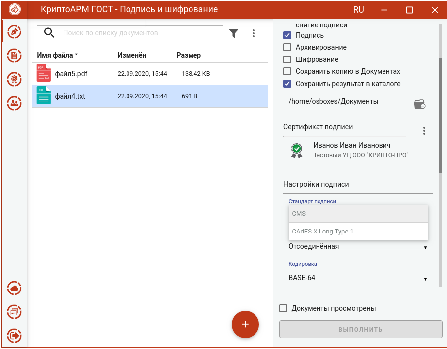
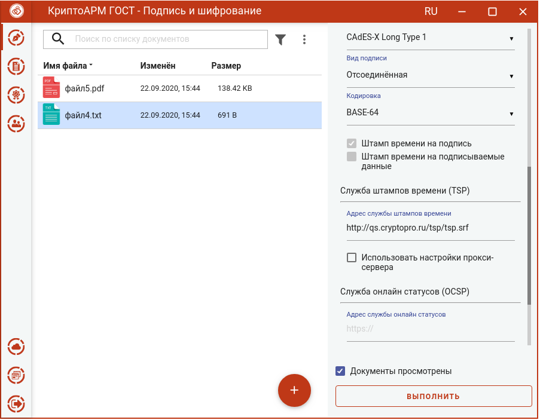
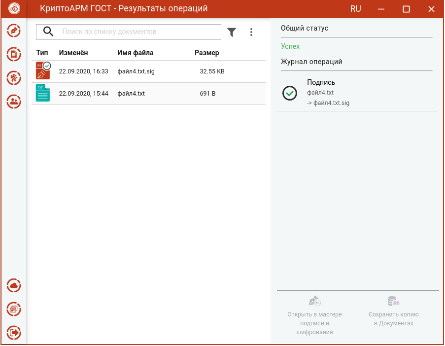
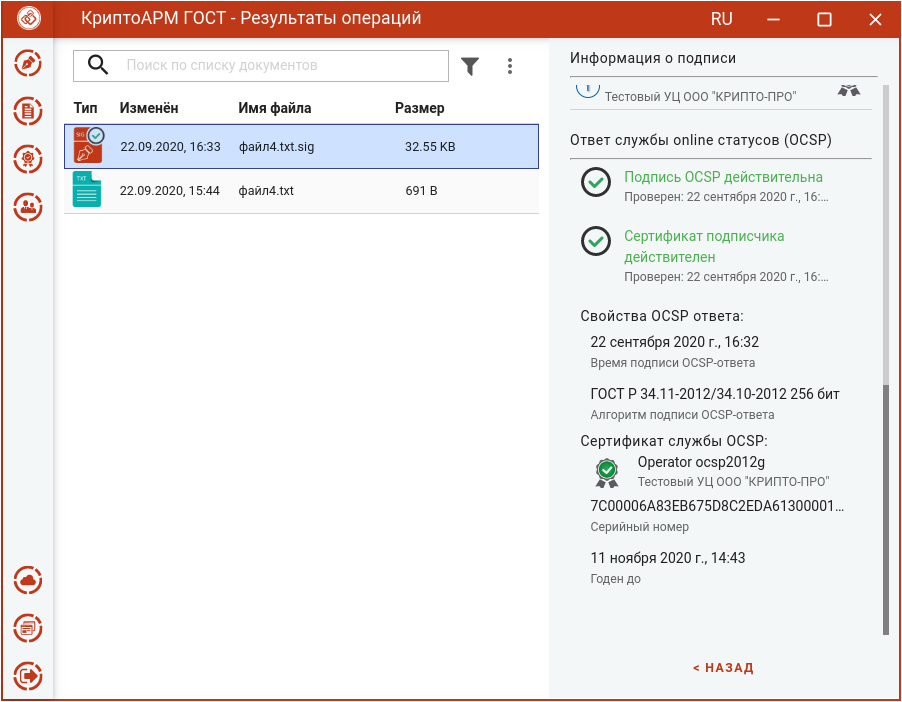
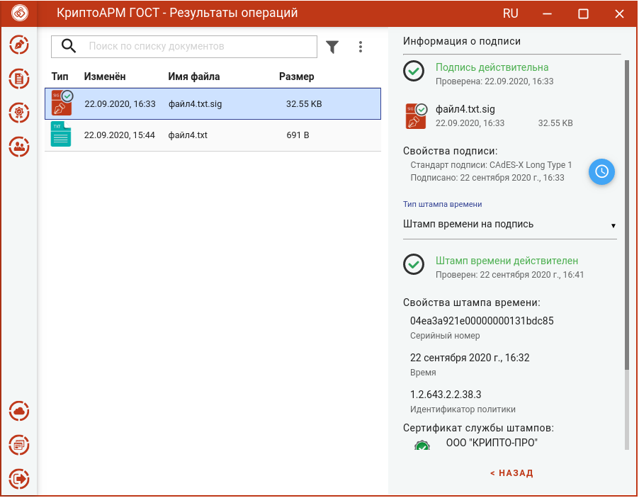
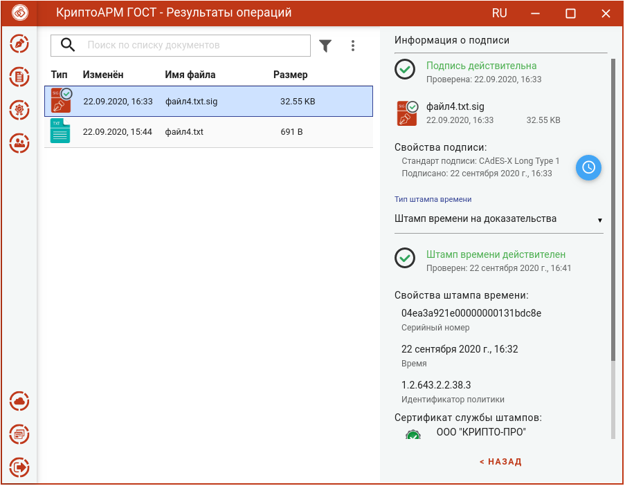

Усовершенствованная квалифицированная электронная подпись поможет доказать юридическую значимость документа в спорных ситуациях. Например, когда помимо авторства и целостности документа (которые дает обычная КЭП) необходимо подтвердить, что сертификат был действителен в момент подписания документа.

Формат усовершенствованной подписи предусматривает включение в электронную подпись информации о времени создания подписи (TSP) и о статусе сертификата электронной подписи (OCSP) в момент подписания (действителен или отозван).

Создание усовершенствованной подписи возможно только при установленных модулях TSP Client и OCSP Client и лицензий на них.

Для создания усовершенствованной подписи нужно:
-  выбрать подписываемые файлы (подробнее в разделе **Выбор подписываемых файлов**);
-  задать параметры подписи (подробнее в разделе **Установка параметров подписи**);
-  сертификат подписи (подробнее в разделе **Выбор сертификата подписи**);
-  выбрать стандарт подписи **CAdES-X Type 1**;

-   Заполнить параметры раздела **Служба штампов времени (TSP)**: **Адрес  службы штампов времени, Использовать настройки прокси-сервера** (если при     подключении к службе TSP используется прокси-сервер)

-   Заполнить параметры раздела **Службы online статусов (OCSP)**: **Адрес службы online статусов.** Это необязательный параметр, задается, если в сертификате данное поле не заполнено.

После заполнения параметров и установки флага, что **Документы просмотрены** перед их подписанием, становится доступна кнопка **Выполнить.**

Нажатие на кнопку **Выполнить** запускает процесс подписи.

Исходные документы (оригиналы) и результаты операции подписи отображаются в отдельном мастере **Результаты операций**.

При просмотре свойств подписи отображается информация о OCSP ответе.

Информация о штампе времени на подпись.

Информация о доказательствах подлинности.

