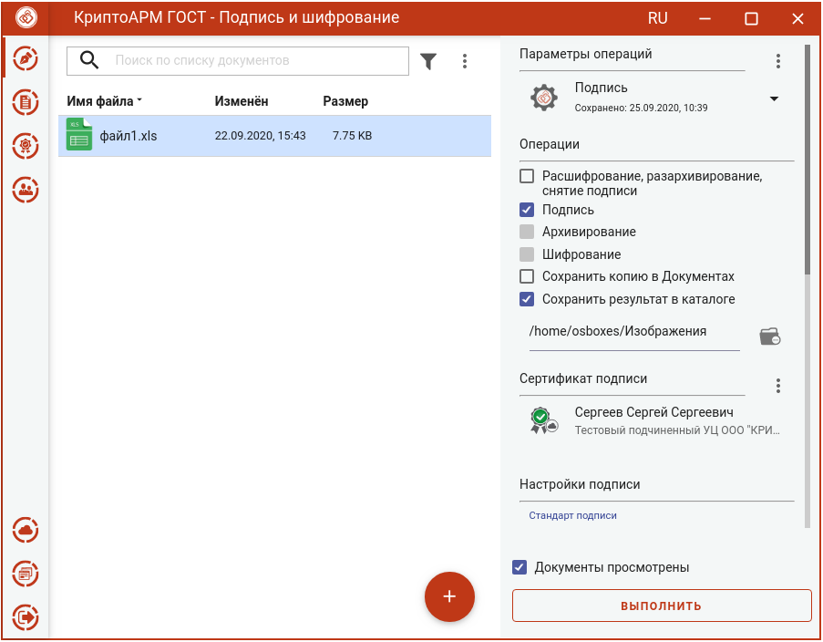
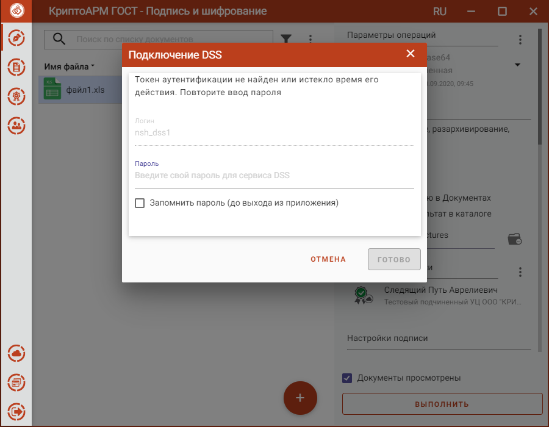
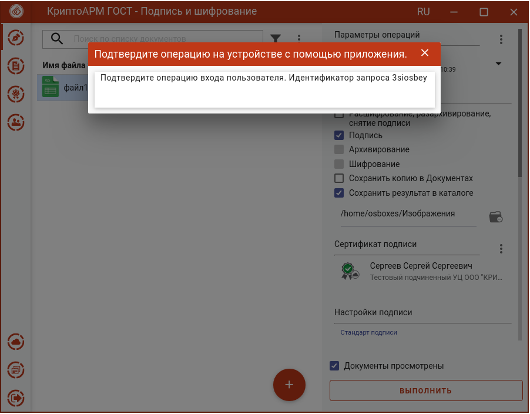
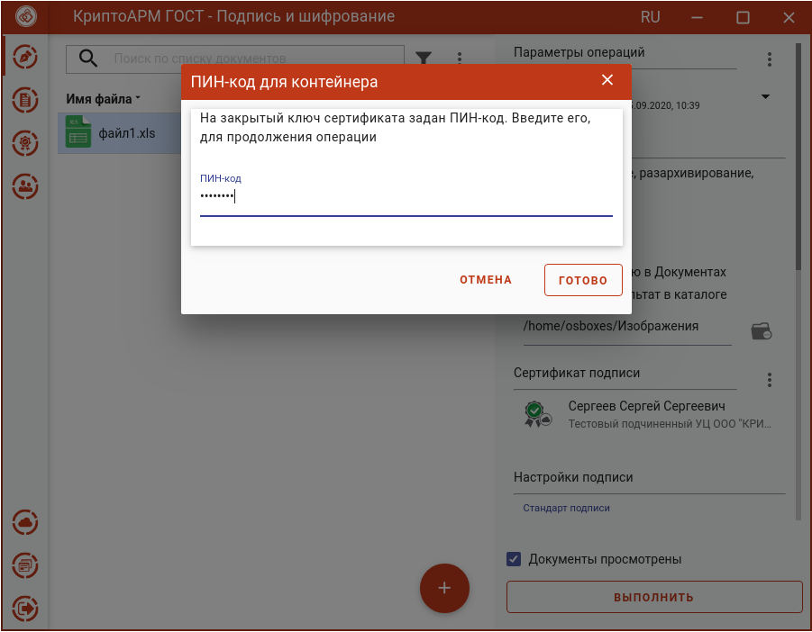
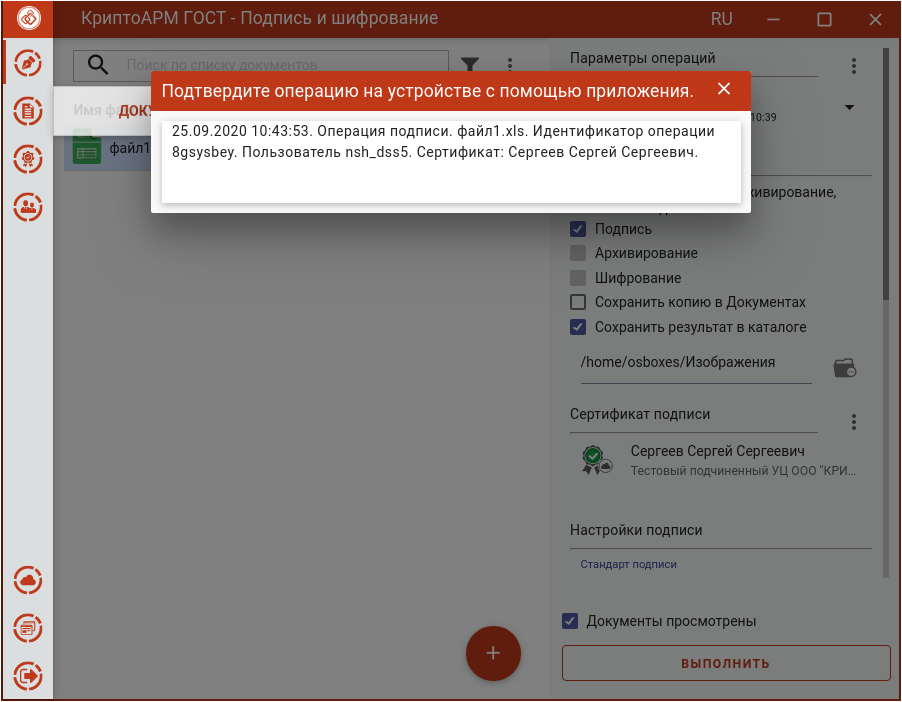
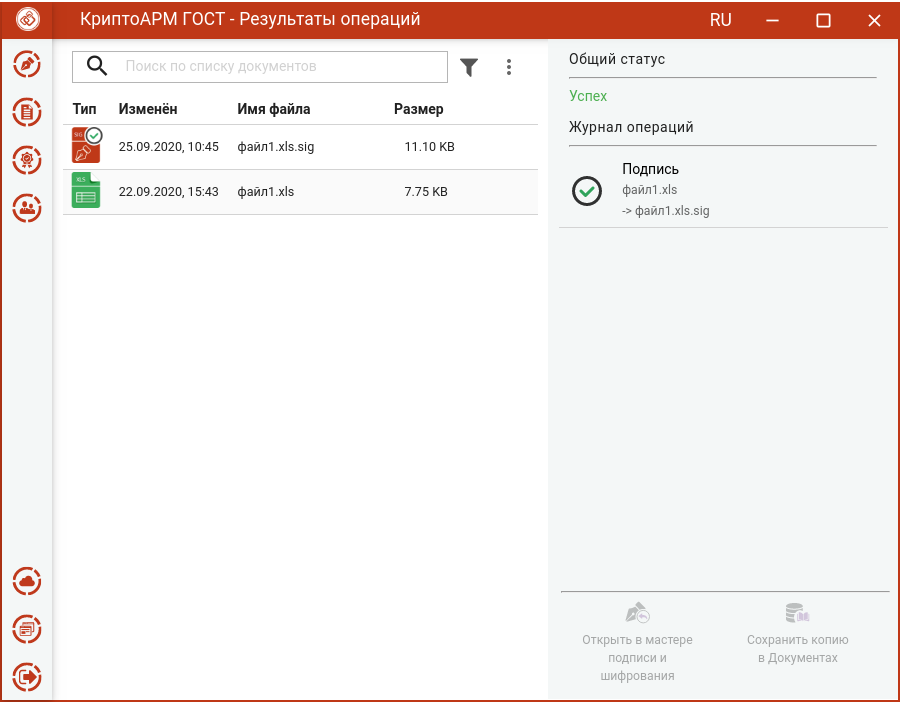

Подпись сертификатом DSS ничем не отличается от подписи обычным сертификатом, за исключением некоторых шагов.

Для подписи нужно:
-  выбрать подписываемые файлы (подробнее в разделе **Выбор подписываемых файлов**);
-  задать параметры подписи (подробнее в разделе **Установка параметров подписи**);
-  сертификат подписи DSS(подробнее в разделе **Выбор сертификата подписи**); 
-  установить флаг, что **Документы просмотрены** перед подписанием.

При нажатии на кнопку **Выполнить** открывается:

-   окно для ввода пароля для аутентификации на сервисе DSS, если для аутентификации задан пароль и время действия токена аутентификации истекло. Если токен аутентификации не истек, то данный шаг пропускается.

	

-   окно для подтверждения аутентификации на сервисе DSS, если для аутентификации задан вход по сим карте или по мобильному приложению, и время действия токена аутентификации истекло. Если токен аутентификации не истек, то данный шаг пропускается.

	

Далее открывается окно для ввода пароля к ключевому контейнеру. Если пароль не задан, то данный шаг пропускается.

Если у пользователя в личном кабинете DSS в настройках аутентификации стоит подтверждение операции подписи по сим карте или с помощью мобильного приложения, то на следующем шаге появляется сообщение, что операцию нужно подтвердить.

После подтверждения операции на устройстве происходит подпись файла.

Для DSS подписи наличие лицензии на программный продукт КриптоПро CSP необязательно.
