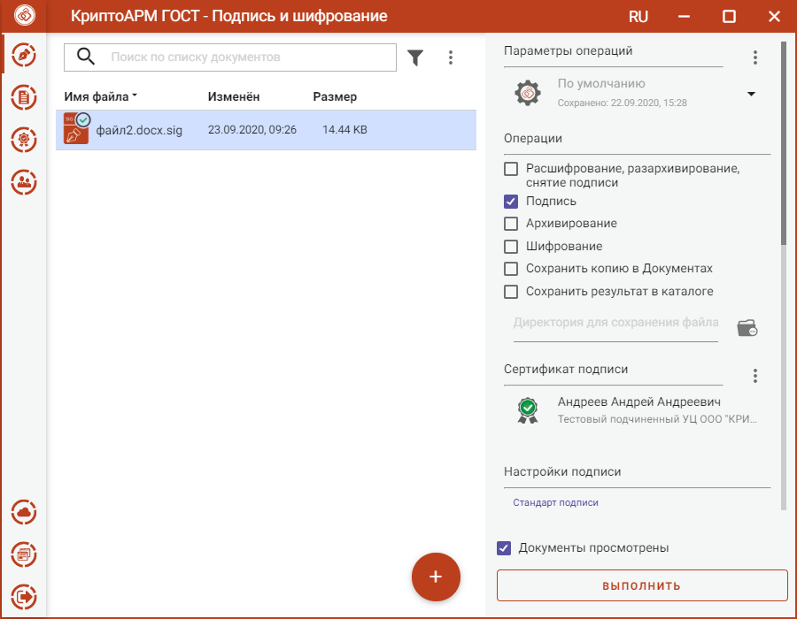
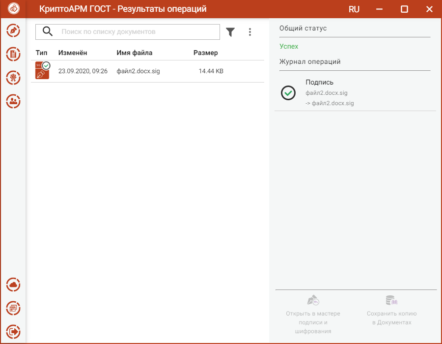
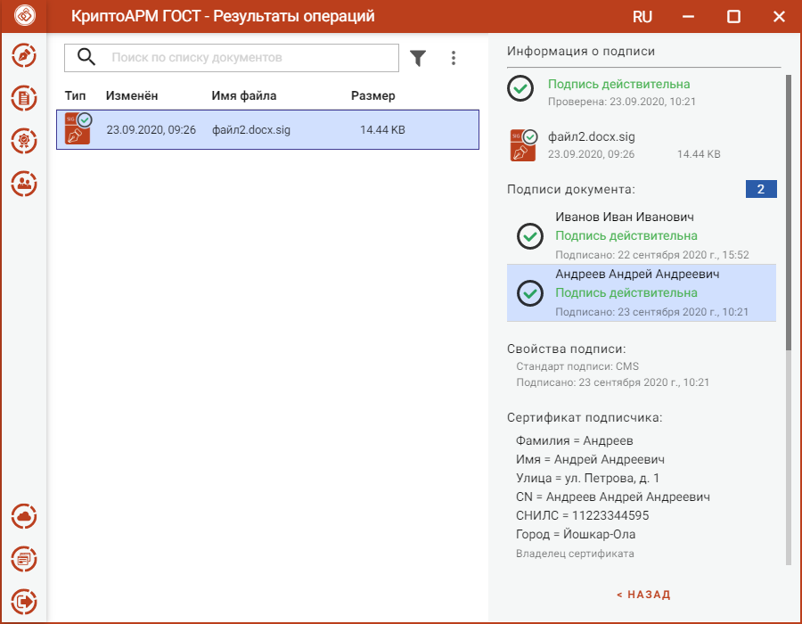

Приложение КриптоАРМ ГОСТ позволяет добавлять электронные подписи к уже
подписанному файлу.
Для этого нужно:
- выбрать файл, содержащий электронную подпись (с расширением **.sig**) (подробнее в разделе **Выбор подписываемых файлов**),
- установить опцию **Подпись**,
- задать сертификат подписи (подробнее в разделе **Выбор сертификата подписи**),
- установить флаг **Документы просмотрены**.

Для всех добавленных подписей настройки, такие как кодировка и вид, используются по умолчанию, как для первой подписи.

Тип подписи и использование штампов времени можно настроить (подробнее в разделе **Создание подписи со штампом времени (TSP)** или **Создание усовершенствованной подписи**).

Можно задать каталог для сохранения подписанного документа, выбрав в операциях опцию **Сохранить результат в каталоге.** Если флаг не установлен, то файл сохраняется папку с исходным файлом.

Опция **Сохранить копию в Документах** служит для сохранения копии полученного после операции файла в специальный каталог Documents, расположенный в папке пользователя в каталоге ./Trusted/CryptoARM GOST/. Файлы из данного каталога доступны в пункте меню **Документы**.

Выбранные параметры подписи можно сохранить и использовать при последующих запусках приложения. Процесс сохранения и изменения параметров описан в разделе **Управление параметрами операции**.

Нажатие на кнопку **Выполнить** запускает процесс подписи. Результаты операции соподписи отображаются в отдельном мастере **Результаты операций**.

Подписанный файл сохраняется в заданном каталоге, если в операциях был выбран каталог для сохранения результатов. Или исходный файл заменяется, если в операциях не был установлен флаг **Сохранить результат в каталоге**. Если в операциях был установлен флаг **Сохранить копию в Документах**, то копия полученного после операции файла сохраняется в специальный каталог Documents, расположенный в папке пользователя в каталоге ./Trusted/CryptoARM GOST/. Файлы из данного каталога доступны в пункте меню **Документы**.

Для подписанного документа доступны операции:

- **Просмотр** - открывается оригинал документа через приложение, которое ассоциировано с его расширением;

- **Проверить подпись** – принудительно запускает процесс проверки подписи;

- **Перейти к файлу** - выполняется открытие каталога, в котором располагается файл.

При выделении подписного файла открывается информация, содержащая сведения о всех подписях. Чтобы посмотреть информацию о конкретной подписи, нужно выбрать ее из списка.

Выбор подписи при просмотре информации

Документы из **Результатов операций** можно **Открыть в мастере Подписи и шифрования** для выполнения других операций или **Сохранить копию в Документах**. Операция **Сохранить копию в Документах** служит для сохранения копии полученного после операции файла в специальный каталог Documents, расположенный в папке пользователя в каталоге ./Trusted/CryptoARM GOST/. Файлы из данного каталога доступны в пункте меню **Документы**.

После выполнения операции мастер **Подписи и шифрования** очищается от добавленных в него файлов. Результаты операций сохраняются до выполнения следующей операции или до закрытия приложения и доступны в меню **Подпись и шифрование - Результаты операций**.
