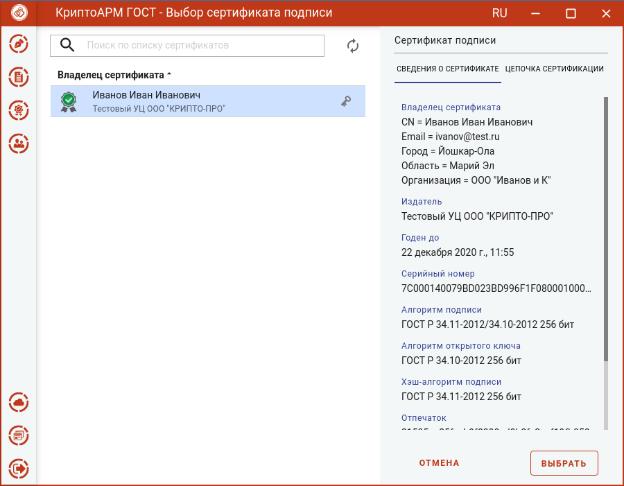
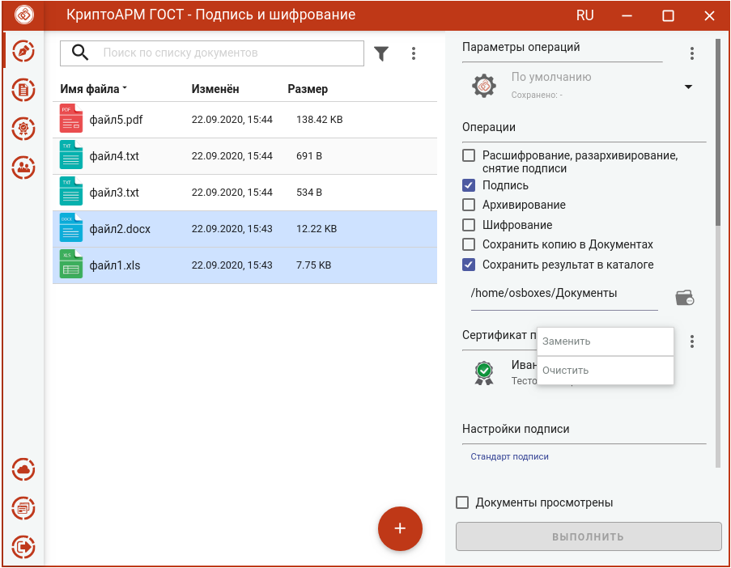

Для того, чтобы выполнить подпись необходимо выбрать сертификат, к которому привязан закрытый ключ.

Эта операция производится нажатием кнопки **Выбрать** сертификат подписи.

В появившемся диалоговом окне отображаются сертификаты категории **Личные**, которые могут использоваться для подписи.

Выбор сертификата подписи осуществляется его выделением и нажатием на кнопку **Выбрать**.

Сертификат подписи можно изменить с помощью контекстного меню.

Если в хранилище личных сертификатов нет сертификата с закрытым ключом, то можно его создать или импортировать в разделе **Сертификаты**.
