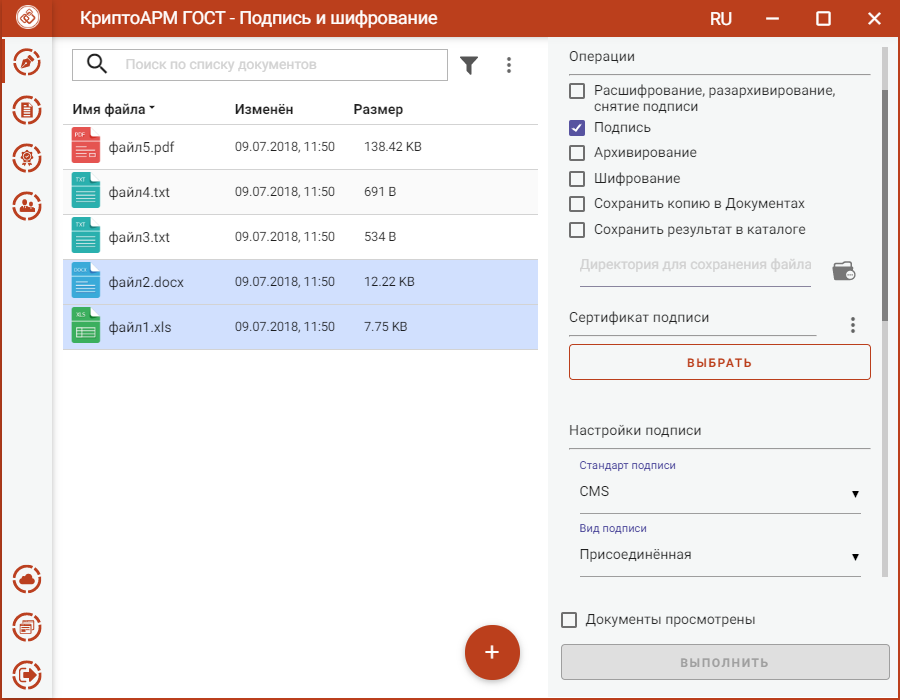
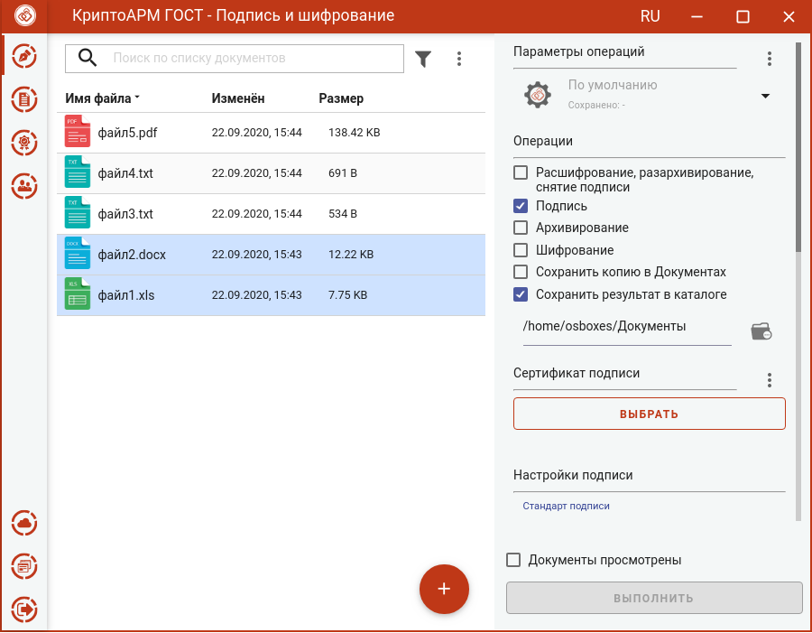

Для подписи файлов в разделе **Операции** необходимо выбрать опцию **Подпись**, становятся доступны параметры подписи.

В параметрах можно настроить:

-   **Сертификат подписи** – личный сертификат с закрытым ключом.

-   **Стандарт подписи** – CMS для создания классической подписи или CAdES-X Long Type 1 - для усовершенствованной подписи. При выборе стандарта CAdES-X Long Type 1 требуется заполнить поля в разделе **Служба штампов времени (TSP)** (подробнее в разделе **Создание усовершенствованной подписи**). Стандарт  подписи CAdES-X Long Type 1 доступен только при установленных модулях КриптоПро TSP Client и КриптоПро OCSP Client.

-   **Вид подписи** – присоединённая или отсоединённая.

-   **Кодировка** - сохранение подписи в одной из двух кодировок BASE64 или DER.

-   **Штамп времени на подпись** – предназначен для создания подписи со штампом времени на подпись. При установке флага требуется заполнить поля в разделе **Служба штампов времени (TSP)** (подробно в разделе **Создание подписи со штампом времени**). Данная опция доступна только при установленном модуле КриптоПро TSP Client.

-   **Штамп времени на подписанные данные** – предназначен для создания подписи со штампом времени на данные. При установке флага требуется заполнить поля в разделе **Служба штампов времени (TSP)** (подробно в разделе **Создание подписи со штампом времени**). Данная опция доступна только при установленном модуле КриптоПро TSP Client.

Можно задать каталог для сохранения подписанных документов, выбрав в операциях опцию **Сохранить результат в каталоге.** При установке флага становится доступно поле выбора каталога.

Если флаг не установлен, то файл сохраняется рядом с исходным файлом.

Опция **Сохранить копию в Документах** служит для сохранения копии полученного после операции файла в специальный каталог Documents, расположенный в папке пользователя в каталоге ./Trusted/CryptoARM GOST/. Файлы из данного каталога доступны в пункте меню **Документы**.

Выбранные параметры подписи можно сохранить и использовать при последующих запусках приложения. Процесс сохранения и изменения параметров описан в разделе **Управление параметрами операции**.
