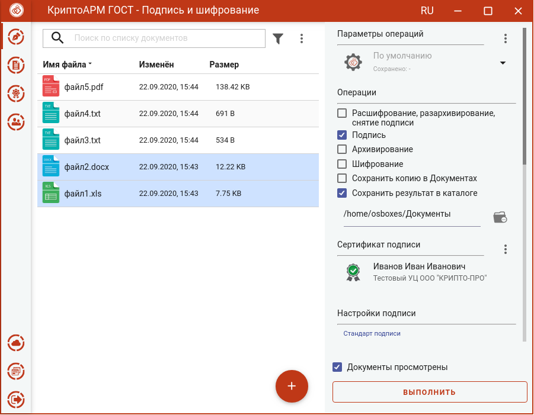
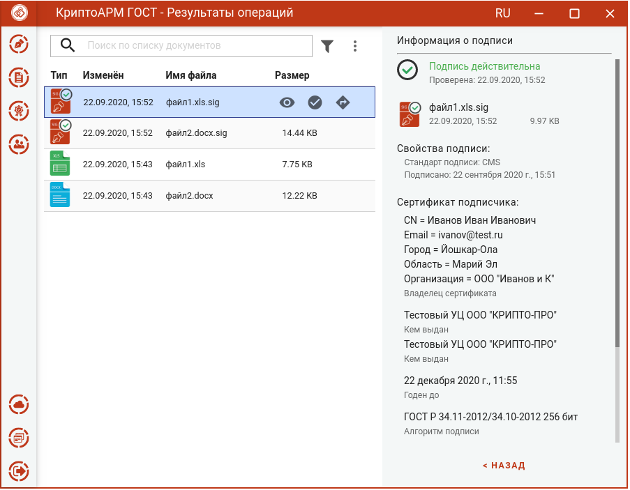
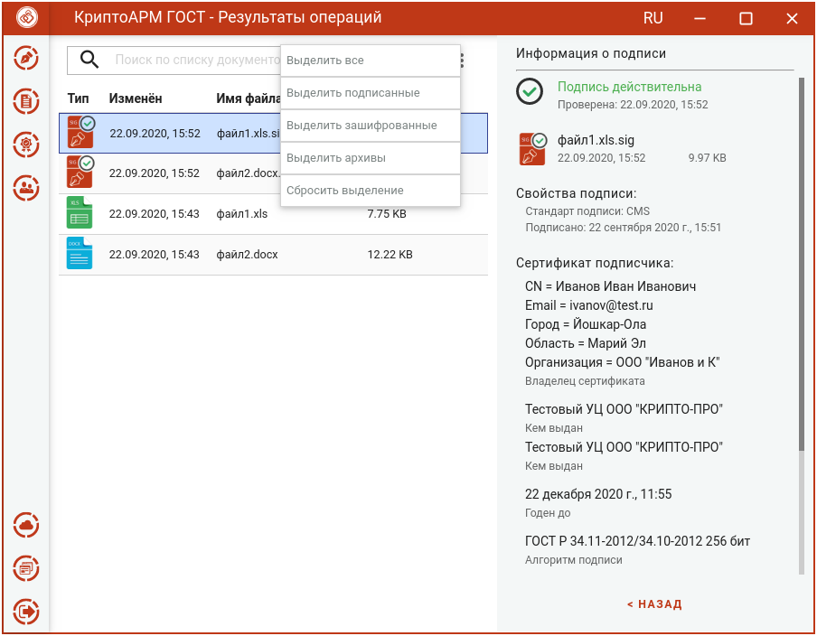

Подписать файлы можно на странице **Подпись и шифрование**.
Для этого нужно:
-  выбрать подписываемые файлы (подробнее в разделе **Выбор подписываемых файлов**),
-  задать параметры подписи (подробнее в разделе **Установка параметров подписи**);
-  выбрать сертификат подписи (подробнее в разделе **Выбор сертификата подписи**).

При условии выбора сертификата подписи, файлов и установленного флага, что **Документы просмотрены**, в мастере становится доступной кнопка **Выполнить**.

Подписать можно любые файлы, кроме зашифрованных.

Нажатие на кнопку **Выполнить** запускает процесс подписи. Исходные документы (оригиналы) и результаты операции отображаются в отдельном мастере **Результаты операций**.

Подписанные файлы сохраняются в заданном каталоге, если в операциях был выбран каталог для сохранения результатов. Или рядом с исходным файлом, если в операциях не был установлен флаг **Сохранить результат в каталоге**.

Если в операциях был установлен флаг **Сохранить копию в Документах**, то  копия полученного после операции файла сохраняется в специальный каталог Documents, расположенный в папке пользователя в каталоге ./Trusted/CryptoARM GOST/. Файлы из данного каталога доступны в пункте меню **Документы**.

Подпись проверяется автоматически.

Для просмотра информации о подписи нужно выделить один файл в списке.

Для каждого документа доступны операции:

-   **Просмотр** - выполняется открытие файла через приложение, которое ассоциировано с его расширением. Для подписанных файлов открывается оригинал документа;

-   **Проверить подпись** – доступна только для подписанных файлов. Принудительно запускает процесс проверки подписи;

-   **Перейти к файлу** - выполняется открытие каталога, в котором располагается файл.

Для списка документов доступно контекстное меню, позволяющее выделить файлы по типу операции.

Документ из **Результатов операций** можно **Открыть в мастере Подписи и шифрования** для выполнения других операций. Операция **Сохранить копию в Документах** служит для сохранения копии полученного после операции файла в специальный каталог Documents, расположенный в папке пользователя в каталоге ./Trusted/CryptoARM GOST/. Файлы из данного каталога доступны в пункте меню **Документы**.

После выполнения операции мастер **Подписи и шифрования** очищается от добавленных в него файлов. Результаты операций сохраняются до выполнения следующей операции или до закрытия приложения и доступны в меню **Подпись и шифрование - Результаты операций**.
