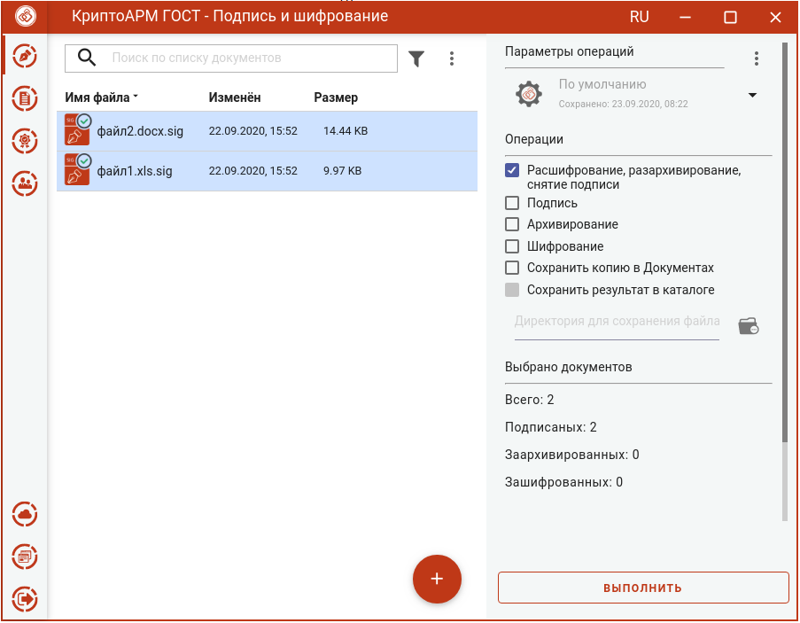
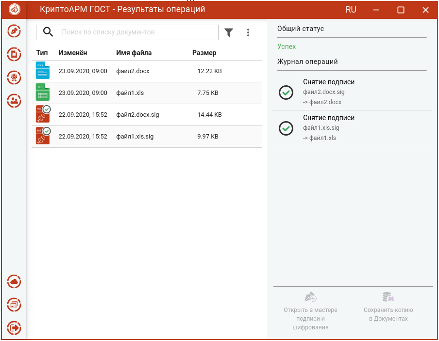

Для снятия подписи достаточно выбрать файлы с расширением **.sig**, которые содержат электронную подпись, выбрать операцию **Расшифрование, разархивирование, снятие подписи** и нажать на кнопку **Выполнить**.
Дополнительные параметры при снятии подписи выбирать не нужно.

Подписанные и полученные файлы отображаются в отдельном мастере **Результаты операций**.

Документы из **Результатов операций** можно **Открыть в мастере Подписи и шифрования** для выполнения других операций или **Сохранить копию в Документах**. Операция **Сохранить копию в Документах** служит для сохранения копии полученного после операции файла в специальный каталог Documents, расположенный в папке пользователя в каталоге ./Trusted/CryptoARM GOST/. Файлы из данного каталога доступны в пункте меню **Документы**.

**Внимание!** Документы, полученные в результате обратных операций (расшифрование, разархивирование, снятие подписи), сохраняются во временную папку, расположенную в папке пользователя в каталоге ./Trusted/CryptoARM GOST/TEMP, и остаются там до выполнения следующей операции. Далее временная папка очищается.

После выполнения операции файлы из мастера **Подписи и шифрования** удаляются. Результаты операций сохраняются до выполнения следующей операции или до закрытия приложения и доступны в меню **Подпись и шифрование - Результаты  операций**.

Для отделенной подписи при выполнении операции снятия подписи возникает сообщение об ошибке.
