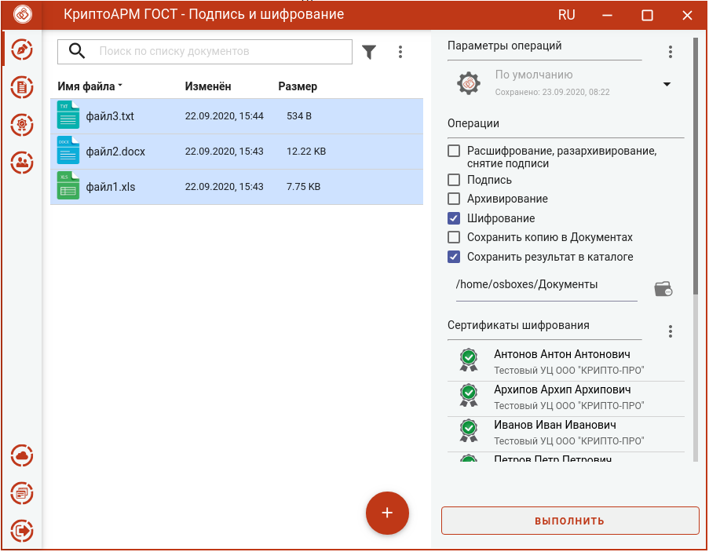
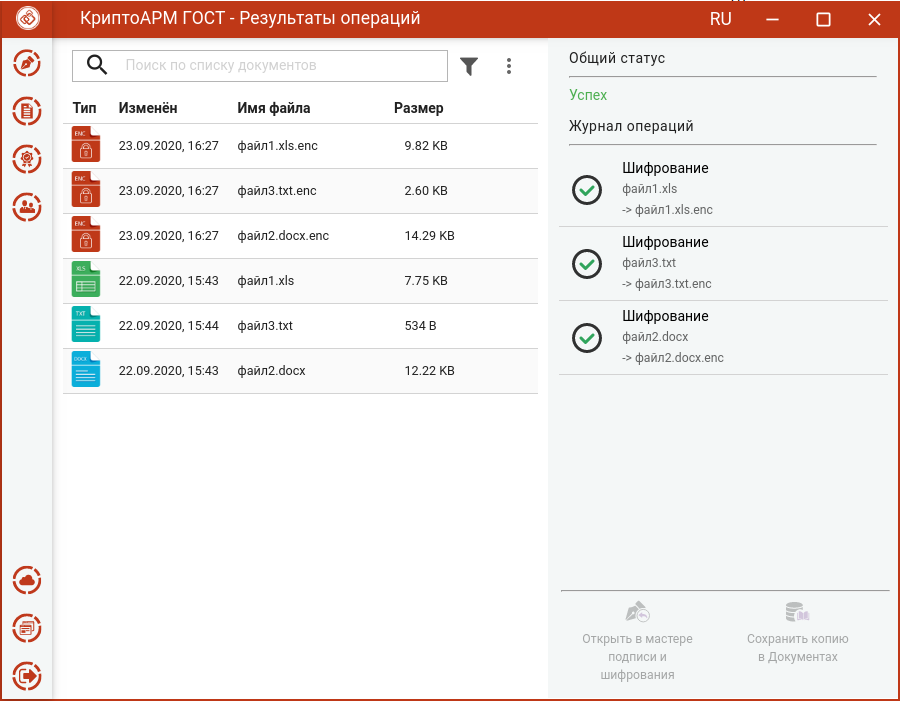

Зашифровать файлы можно на странице **Подпись и шифрование**.

Для этого нужно:
-  выбрать файлы для шифрования (подробнее в разделе **Выбор файлов для шифрования**),
-  задать параметры шифрования (подробнее в разделе **Настройка параметров шифрования**);
-  задать сертификаты получателей (подробнее в разделе **Выбор сертификатов шифрования**).

При соблюдении всех условий становится доступной кнопка **Выполнить**. Шифровать можно любые
файлы, кроме зашифрованных.

Нажатие на кнопку **Выполнить** запускает процесс шифрования. Исходные и зашифрованные файлы отображаются в отдельном мастере **Результаты операций**.

Если в параметрах шифрования была выбрана опция **Удалить файлы после шифрования**, то в **Результатах операций** будут только полученные зашифрованные файлы.

Документы из **Результатов операций** можно **Открыть в мастере Подписи и шифрования** для выполнения других операций или **Сохранить копию в Документах**. Операция **Сохранить копию в Документах** служит для сохранения копии полученного после операции файла в специальный каталог Documents, расположенный в папке пользователя в каталоге ./Trusted/CryptoARM GOST/. Файлы из данного каталога доступны в пункте меню **Документы**.

После выполнения операции мастер **Подписи и шифрования** очищается от добавленных в него файлов. Результаты операций сохраняются до выполнения следующей операции или до закрытия приложения и доступны в меню **Подпись и шифрование - Результаты операций**. 
