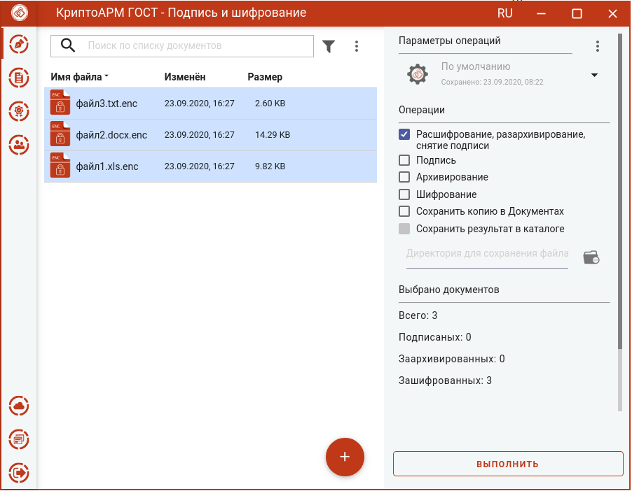
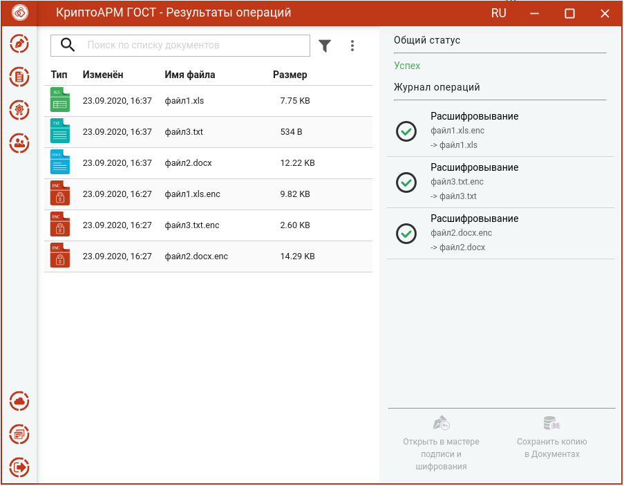
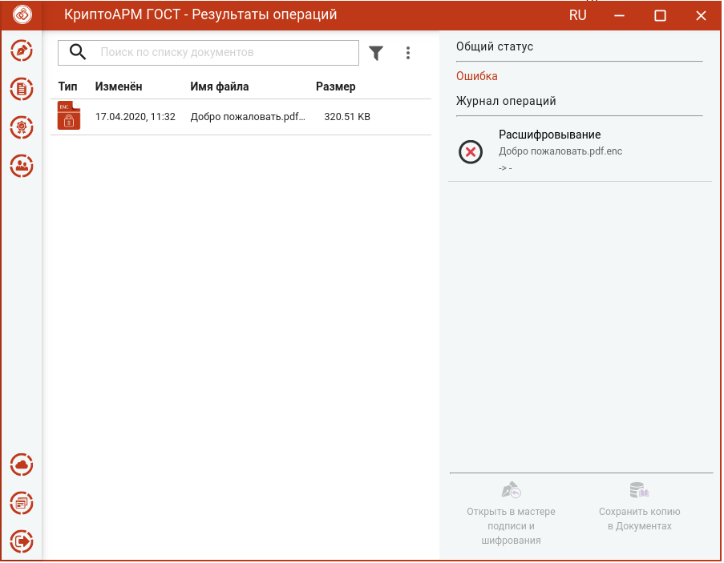

Для расшифрования достаточно в мастере **Подписи и шифрования** выбрать зашифрованные файлы с расширением **. enc**, выбрать операцию **Расшифрование, разархивирование, снятие подписи** и  нажать на кнопку **Выполнить**. Настройка дополнительных параметров для  операции расшифрования не требуется.

Исходные зашифрованные и полученные файлы отображаются в отдельном мастере **Результаты операций.**

**Внимание!** Документы, полученные в результате обратных операций (расшифрование, разархивирование, снятие подписи), сохраняются во временную папку, расположенную в папке пользователя в каталоге ./Trusted/CryptoARM GOST/ TEMP, и остаются там до выполнения следующей операции. Далее временная папка очищается.

Документы из результатов операции можно **Открыть в мастере Подписи и шифрования** для выполнения других операций или **Сохранить копию в** Документах**. Операция **Сохранить копию в Документах** служит для сохранения копии полученных после операции файлов в специальный каталог Documents, расположенный в папке пользователя в каталоге ./Trusted/CryptoARM GOST/. Файлы из данного каталога доступны в пункте меню **Документы**.

Если в хранилище сертификатов не окажется сертификата с закрытым ключом,  который был выбран в качестве сертификата получателя при шифровании, расшифрование не будет выполнено. В мастере **Результаты операций** будут только зашифрованные файлы.

