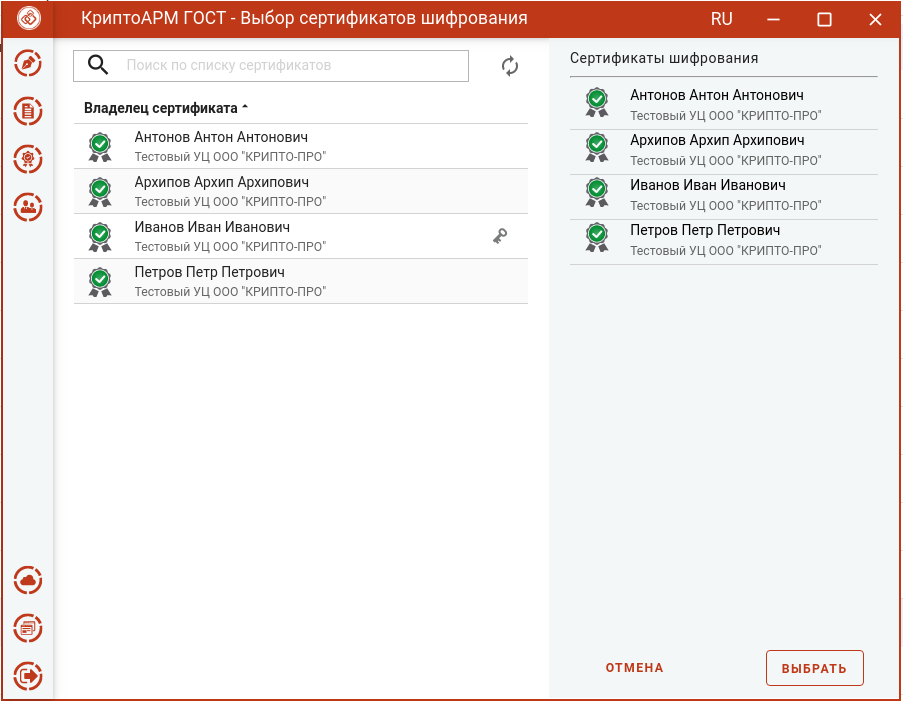
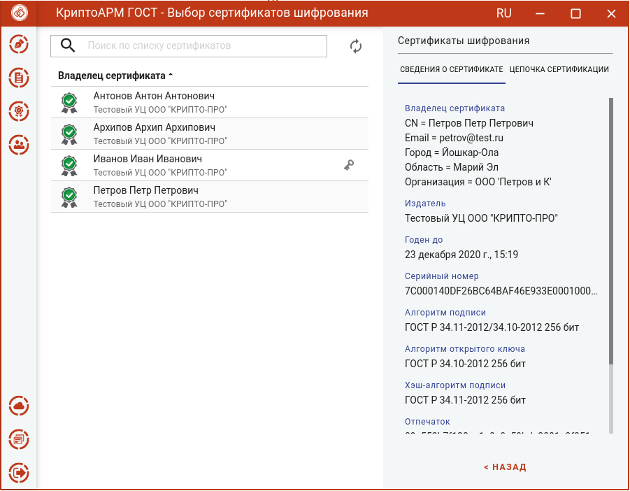
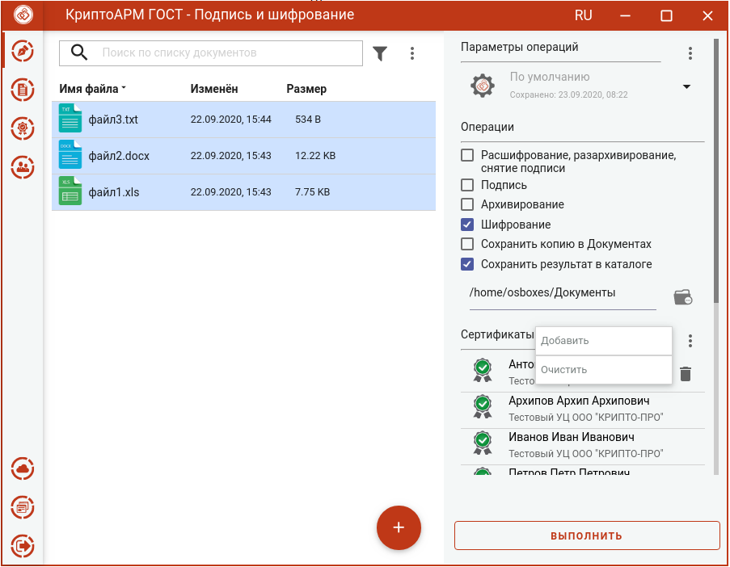

Для того, чтобы выполнить шифрование необходимо выбрать сертификаты получателей.

Эта операция производится нажатием кнопки **Выбрать** сертификаты шифрования. В появившемся диалоговом окне отображаются сертификаты категории **Личные** и категории **Сертификаты других пользователей**.

В списке допускается выбор нескольких сертификатов, так как число получателей может быть различным.

Выбранные сертификаты получателей перемещаются в правый список. Сертификаты в списке можно удалять, по ним можно посмотреть детальную информацию, нажав на интересующий сертификат в правой области.

Если список сертификатов получателей заполнен, то его можно зафиксировать нажатием на кнопку **Выбрать**.

Изменить список сертификатов шифрования можно с помощью контекстного меню. Удалить сертификаты из сформированного списка можно кнопкой **Удалить**.

Если список личных сертификатов и сертификатов других пользователей пуст, то можно их создать или импортировать (подробнее в разделе **Сертификаты**).
