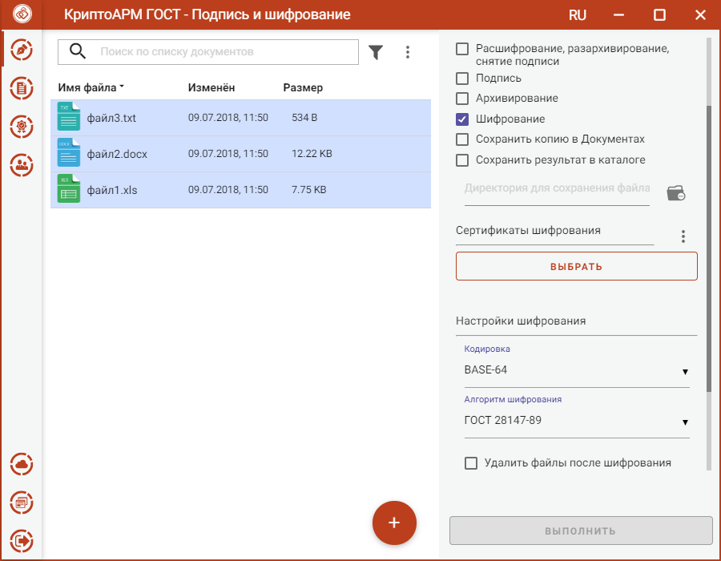
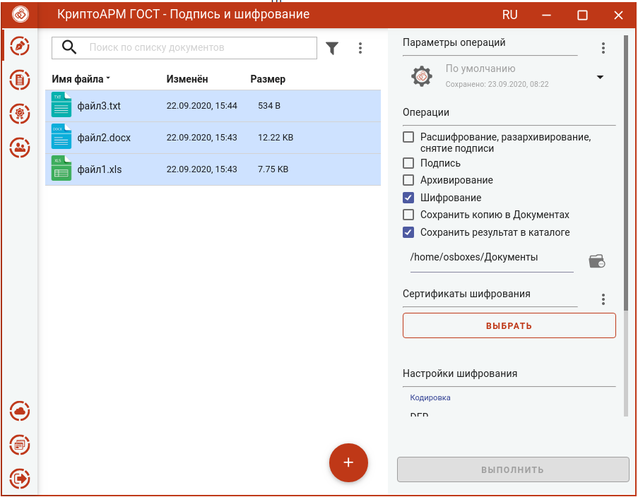

Для доступа к настройке параметров шифрования в разделе **Операции** необходимо выбрать опцию **Шифрование**.

В параметрах можно настроить:

-   **Кодировка** - сохранение зашифрованного файла в одной из двух кодировок BASE64 или DER.
-   **Алгоритм шифрования** – файл шифруется по одному из алгоритмов: «ГОСТ 28147-89», «ГОСТ Р 34.12-2015 Магма», «ГОСТ Р 34.12-2015 Кузнечик». Данный параметр доступен для выбора только начиная с версии КриптоПро CSP 5.0.11635.
-   **Удалить файлы после шифрования** исходные файлы, в случае успешного завершения операции, удаляются из файловой системы.

Можно задать каталог для сохранения зашифрованных документов, выбрав в операциях опцию **Сохранить результат в каталоге**. При установке флага становится доступно поле выбора каталога.

Если флаг не установлен, то файлы сохраняются рядом с исходным файлом.

Опция **Сохранить копию в Документах** служит для сохранения копии полученного после операции файла в специальный каталог Documents, расположенный в папке пользователя в каталоге ./Trusted/CryptoARM GOST/. Файлы из данного каталога доступны в пункте меню **Документы**.

Выбранные параметры шифрования можно сохранить и использовать при последующих запусках приложения. Процесс сохранения и изменения параметров описан в разделе **Управление параметрами операции**.
