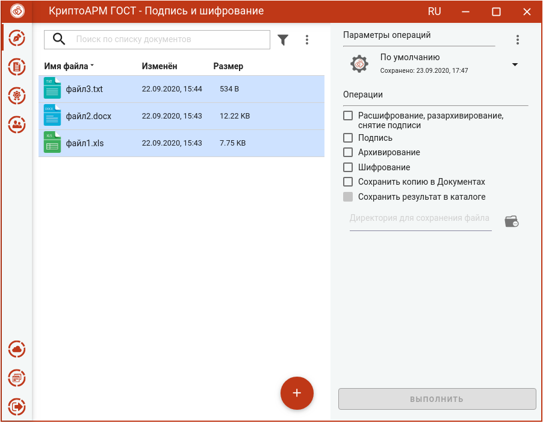
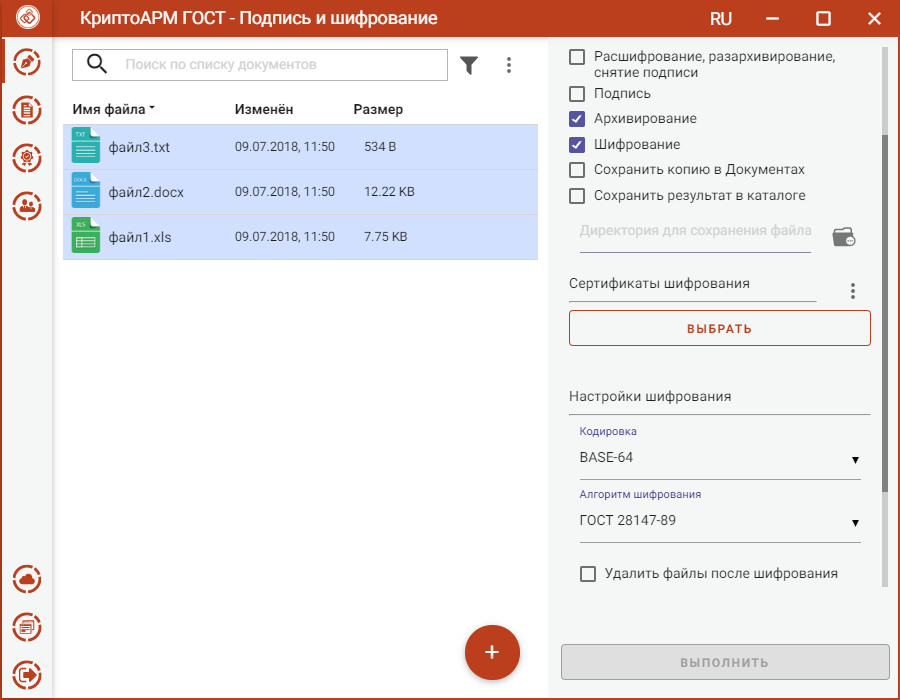
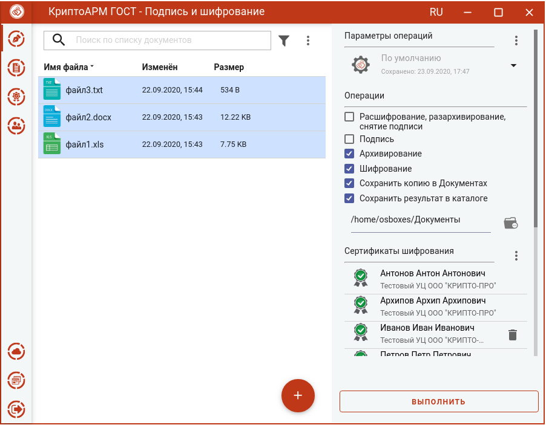
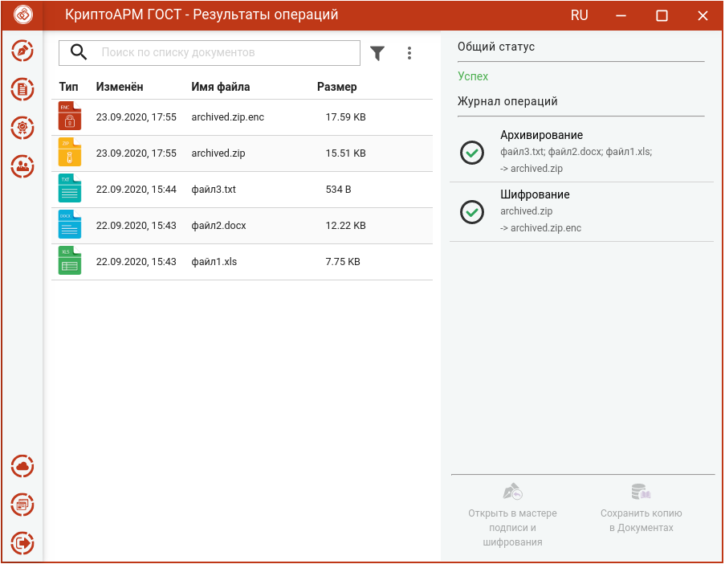

Для архивирования и шифрования файлов нужно в мастере **Подписи и шифрования** выбрать файлы, выбрать в разделе операций опции **Архивирование** и **Шифрование**, задать сертификаты получателей, параметры шифрования.

## Выбор файлов

В приложении доступно выполнение операций для одного или группы файлов. Файлы можно добавить двумя способами: через кнопку **Добавить (+)** или перетащив мышкой в область формирования списка файлов для операции.

Выбранные файлы заносятся в левую область и представляют собой одноуровневый список.

Для данного списка доступны поиск, фильтрация, управление файлами в списке  через контекстное меню и кнопки для каждого файла.

## Установка параметров архивирования и шифрования

В разделе **Операции** необходимо выбрать опции **Архивирование** и **Шифрование,** становятся доступны настройки параметров шифрования.

В параметрах шифрования можно настроить:

-   **Сертификаты шифрования** - сертификаты получателей. Выбор производится нажатием кнопки **Выбрать** сертификаты шифрования. В появившемся диалоговом окне отображаются сертификаты категории **Личные** и категории **Сертификаты других пользователей (Контакты)**. В списке сертификатов допускается выбор нескольких сертификатов, так как число получателей может быть различным.
-   **Кодировка** - сохранение зашифрованного файла в одной из двух кодировок BASE64 или DER.
-   **Алгоритм шифрования** – файл шифруется по одному из алгоритмов: «ГОСТ 28147-89», «ГОСТ Р 34.12-2015 Магма», «ГОСТ Р 34.12-2015 Кузнечик». Данный параметр доступен для выбора только начиная с версии КриптоПро CSP 5.0.11635.
-   **Удалить файлы после шифрования** исходные файлы, над которыми выполняется операция шифрования, удаляются из файловой системы в случае успешного завершения операции.

Можно задать каталог для сохранения полученных документов, выбрав в операциях опцию **Сохранить результат в каталоге.** При установке флага становится доступно поле выбора каталога. Если флаг не установлен, то файлы сохраняются рядом с исходным.

Опция **Сохранить копию в Документах** служит для сохранения копии полученных после операции файлов в специальный каталог Documents, расположенный в папке пользователя в каталоге ./Trusted/CryptoARM GOST/. Файлы из данного каталога доступны в пункте меню **Документы**.

Выбранные параметры можно сохранить и использовать при последующих запусках приложения. Процесс сохранения и изменения параметров описан в разделе **Управление параметрами операции**.

## Архивирование и шифрование файлов 

При условии выбора сертификатов получателей, файлов, в мастере становится доступной кнопка **Выполнить**. Заархивировать и зашифровать можно любые файлы, кроме зашифрованных.

Нажатие на кнопку **Выполнить** запускает процесс архивирования, а затем архив шифруется. Исходные документы (оригиналы), архив (промежуточный) и результаты операции шифрования отображаются в отдельном мастере **Результаты операций.**

Если архивируется несколько файлов, то архиву автоматически задается имя **archived.zip**. Если архивируется один файл, то к имени файла добавляется расширение zip.enc.

Полученный файл сохраняется в каталоге, если в операциях был выбран каталог для сохранения результатов, или в папке пользователя. Архив сохраняется во  временную папку TEMP, расположенную в домашней папке пользователя в каталоге ./Trusted/CryptoARM GOST/, и остается до выполнения следующей операции.

Если в операциях был установлен флаг **Сохранить копию в Документах**, то копия полученного после операции файла сохраняется в специальный каталог Documents, расположенный в папке пользователя в каталоге ./Trusted/CryptoARM  GOST/. Файлы из данного каталога доступны в пункте меню **Документы**.

Если в параметрах шифрования была выбрана опция **Удалить файлы после шифрования**, то в **Результатах операций** будет только полученный зашифрованный файл.

Документы из **Результатов операций** можно **Открыть в мастере Подписи и шифрования** для выполнения других операций или **Сохранить копию в Документах**. Операция **Сохранить копию в Документах** служит для сохранения копии полученного после операции файла в специальный каталог Documents, расположенный в папке пользователя в каталоге ./Trusted/CryptoARM GOST/. Файлы из данного каталога доступны в пункте меню **Документы**.

После выполнения операции мастер **Подписи и шифрования** очищается от добавленных в него файлов. Результаты операций сохраняются до выполнения следующей операции или до закрытия приложения и доступны в меню **Подпись и шифрование - Результаты операций**.
