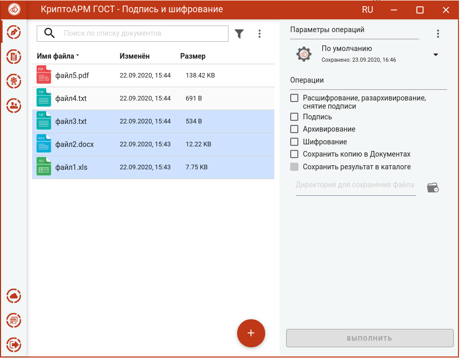
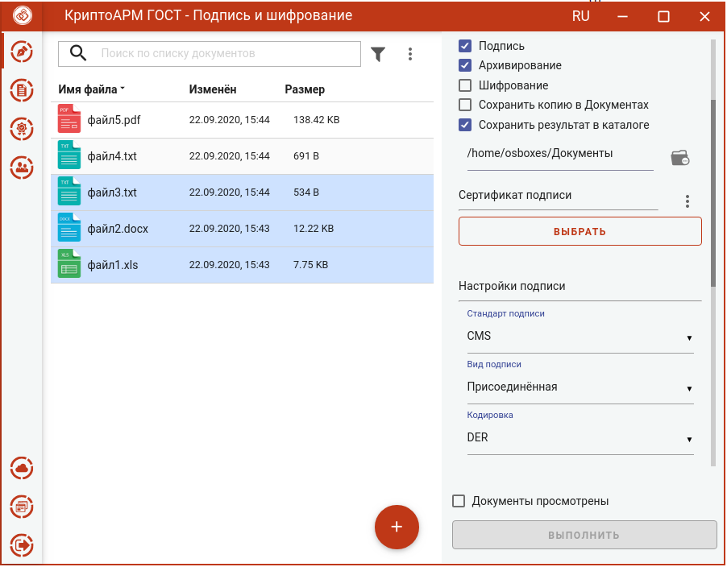
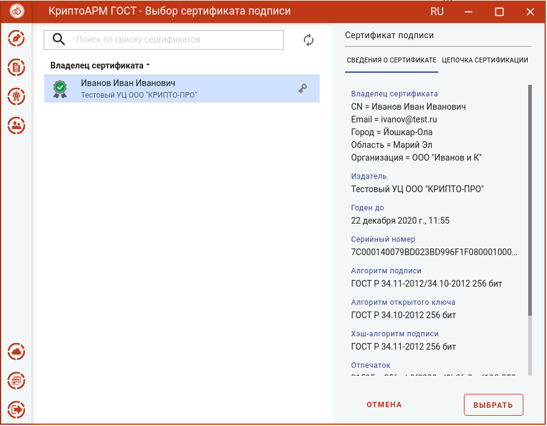
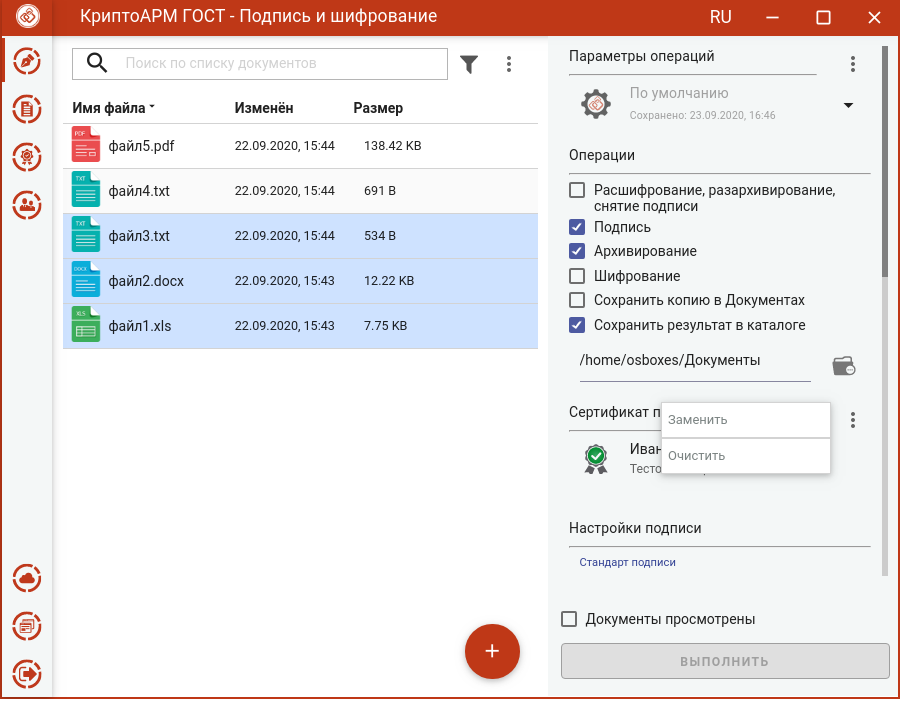
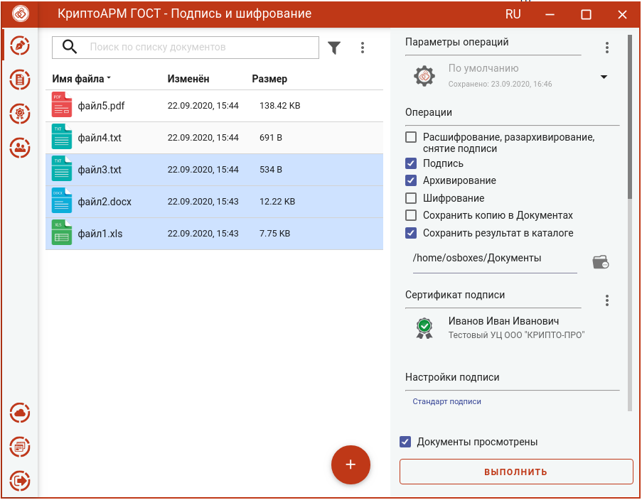
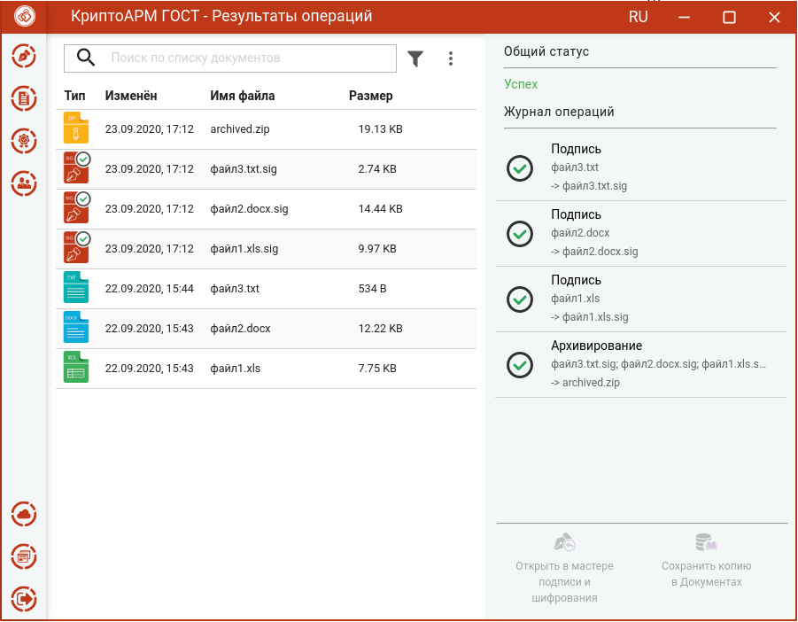

Для подписи и архивирования файлов нужно в мастере **Подпись и шифрование** выбрать файлы, выбрать опции **Подпись** и **Архивирование** в разделе операций, задать сертификат подписи и параметры подписи.

## Выбор файлов

В приложении доступно выполнение операций для одного или группы файлов. Файлы можно добавить двумя способами: через кнопку **Добавить (+)** или перетащив мышкой в область формирования списка файлов.

Выбранные файлы заносятся в левую область и представляют собой одноуровневый список.

## **Установка параметров подписи и архивирования**
Для операций подписи и архивирования файлов в разделе **Операции** необходимо выбрать опции **Подпись** и **Архивирование,** становятся доступны настройки параметров подписи.

В параметрах можно настроить:

-   **Сертификат подписи**.
-   **Стандарт подписи** – CMS для создания классической подписи или CAdES-X Long Type 1 для создания усовершенствованной подписи. При выборе стандарта CAdES-X Long Type 1 требуется заполнить поля в разделе **Служба штампов времени (TSP)** (подробнее в разделе **Создание усовершенствованной подписи**). Стандарт подписи CAdES-X Long Type 1 доступен только при установленном  модуле КриптоПро TSP Client и КриптоПро OCSP Client.
-   **Вид подписи** – присоединённая или отсоединённая.
-   **Кодировка** - сохранение подписи в одной из двух кодировок BASE64 или  DER.
-   **Штамп времени на подпись** – предназначен для создания подписи со штампом времени на подпись. При установке флага требуется заполнить поля в разделе **Служба штампов времени** (подробно в разделе **Создание подписи со штампом времени**). Данная опция доступна только при установленном модуле  КриптоПро TSP Client.
-   **Штамп времени на подписанные данные** – предназначен для создания подписи со штампом времени на данные. При установке флага требуется заполнить  поля в разделе **Служба штампов времени** (подробно в разделе **Создание подписи со штампом времени**). Данная опция доступна только при установленном модуле КриптоПро TSP Client.

Можно задать каталог для сохранения полученных документов, выбрав в операциях опцию **Сохранить результат в каталоге.** При установке флага становится доступно поле выбора каталога. Если флаг не установлен, то файл сохраняется рядом с исходным.

Опция **Сохранить копию в Документах** служит для сохранения копии полученного после операции файла в специальный каталог Documents, расположенный в папке пользователя в каталоге ./Trusted/CryptoARM GOST/. Файлы из данного каталога доступны в пункте меню **Документы**.

Выбранные параметры можно сохранить и использовать при последующих запусках приложения. Процесс сохранения и изменения параметров описан в разделе **Управление параметрами операции**.

## Выбор сертификата подписи

Для того, чтобы выполнить подпись необходимо выбрать сертификат, к которому привязан закрытый ключ. Эта операция производится нажатием кнопки **Выбрать** сертификат подписи. В появившемся диалоговом окне отображаются сертификаты категории **Личные**, которые могут использоваться для подписи.

Выбор сертификата подписи осуществляется его выделением и нажатием на кнопку **Выбрать**.

Сертификат подписи можно изменить с помощью контекстного меню.

Если в хранилище личных сертификатов нет сертификата с закрытым ключом, то можно его создать или импортировать (подробнее в разделе **Сертификаты**).

## Подпись и архивирование файлов

При условии выбора сертификата подписи, файлов и установленного флага, что **Документы просмотрены**, в мастере становится доступной кнопка **Выполнить**. Подписать и заархивировать можно любые файлы, кроме  зашифрованных.

Нажатие на кнопку **Выполнить** запускает процесс подписи, а затем подписанные файлы архивируются. Исходные документы (оригиналы), подписанные файлы (промежуточные) и результаты операции архивирования отображаются в отдельном мастере **Результаты операций**.

Если архивируется несколько файлов, то архиву автоматически задается имя **archived.zip**. Если архивируется один файл, то к имени файла добавляется расширение .sig.zip.

Архив сохраняется в каталоге, если в операциях был выбран каталог для  сохранения результатов, или в домашней папке пользователя, если в операциях не был установлен флаг **Сохранить результат в каталоге**.

Подписанные файлы сохраняются во временную папку TEMP, расположенную в домашней папке пользователя в каталоге ./Trusted/CryptoARM GOST/, и остаются до выполнения следующей операции.

Если в операциях был установлен флаг **Сохранить копию в Документах**, то копия полученного после операции файла сохраняется в специальный каталог  Documents, расположенный в папке пользователя в каталоге ./Trusted/CryptoARM GOST/. Файлы из данного каталога доступны в пункте меню **Документы**.

Для подписанных файлов подпись проверяется автоматически.

После выполнения операции мастер **Подписи и шифрования** очищается от добавленных в него файлов. Результаты операций сохраняются до выполнения следующей операции или до закрытия приложения и доступны в меню **Подпись и шифрование - Результаты операций**.
