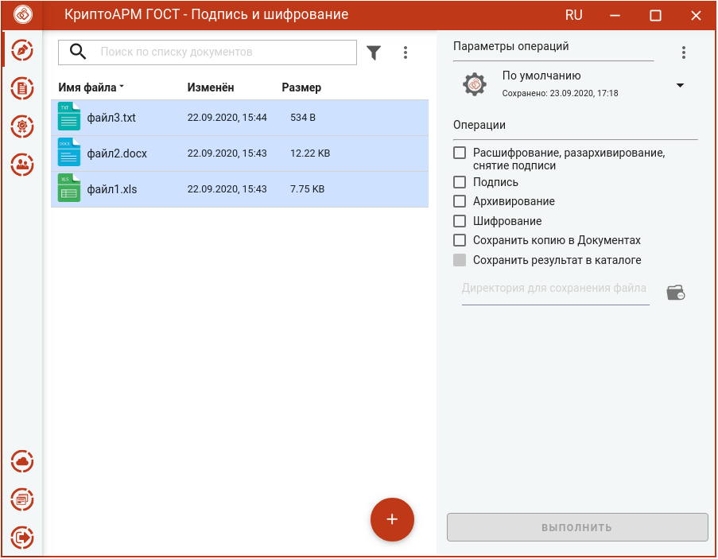
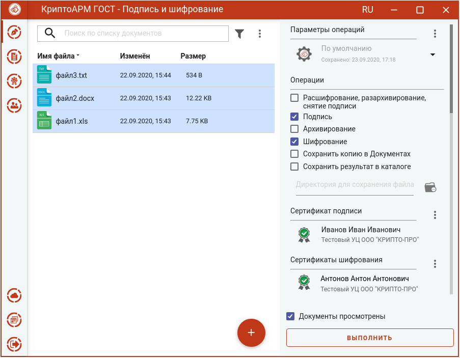
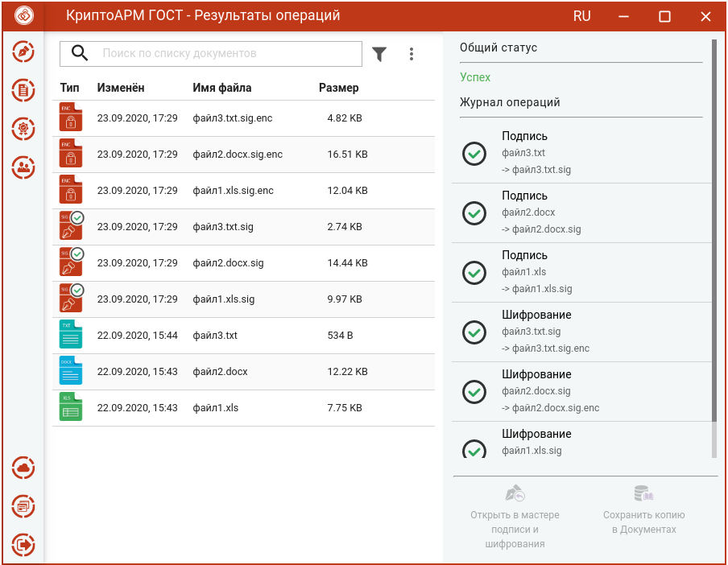

Для подписи и шифрования файлов нужно в мастере **Подпись и шифрование** выбрать файлы, выбрать опции **Подпись** и **Шифрование** в разделе операций,  задать сертификат подписи, сертификаты получателей, параметры подписи и шифрования.

## Выбор файлов

В приложении доступно выполнение операций для одного или группы файлов. Файлы можно добавить двумя способами: через кнопку **Добавить (+)** или перетащив мышкой в область формирования списка файлов.

Выбранные файлы заносятся в левую область и представляют собой одноуровневый список.

Для данного списка доступны поиск, фильтрация, управление файлами в списке через контекстное меню и кнопки для каждого файла.

## Установка параметров подписи и шифрования

Для операций подписи и шифрования файлов в разделе **Операции** необходимо выбрать опции **Подпись** и **Шифрование.** Cтановятся доступны настройки параметров подписи и шифрования.

В параметрах подписи можно настроить:

-   **Сертификат подписи** - сертификат, к которому привязан закрытый ключ. Выбор сертификата производится нажатием кнопки **Выбрать**. В появившемся диалоговом окне отображаются сертификаты категории **Личные**, которые могут использоваться для подписи.
-   **Стандарт подписи** – CMS для создания классической подписи или CAdES-X Long Type 1 для создания усовершенствованной подписи. При выборе стандарта CAdES-X Long Type 1 требуется заполнить поля в разделе **Служба штампов времени (TSP)** (подробнее в разделе **Создание усовершенствованной подписи**). Стандарт подписи CAdES-X Long Type 1 доступен только при установленном модуле  КриптоПро TSP Client и КриптоПро OCSP Client.
-   **Вид подписи** – присоединённая или отсоединённая.
-   **Кодировка** - сохранение подписи в одной из двух кодировок BASE64 или DER. 
-   **Штамп времени на подпись** – предназначен для создания подписи со штампом времени на подпись. При установке флага требуется заполнить поля в  разделе **Служба штампов времени** (подробно в разделе **Создание подписи со штампом времени**). Данная опция доступна только при установленном модуле  КриптоПро TSP Client.
-   **Штамп времени на подписанные данные** – предназначен для создания подписи со штампом времени на данные. При установке флага требуется заполнить поля в разделе **Служба штампов времени** (подробно в разделе **Создание подписи со штампом времени**). Данная опция доступна только при установленном модуле КриптоПро TSP Client.

В параметрах шифрования можно настроить:

-   **Сертификаты шифрования** - сертификаты получателей. Выбор производится нажатием кнопки **Выбрать** сертификаты шифрования. В появившемся диалоговом окне отображаются сертификаты категории **Личные** и категории **Сертификаты других пользователей (Контакты)**. В списке допускается выбор нескольких сертификатов, так как число получателей может быть различным.
-   **Кодировка** - сохранение зашифрованного файла в одной из двух кодировок BASE64 или DER.
-   **Алгоритм шифрования** – файл шифруется по одному из алгоритмов: «ГОСТ 28147-89», «ГОСТ Р 34.12-2015 Магма», «ГОСТ Р 34.12-2015 Кузнечик». Данный параметр доступен для выбора только начиная с версии КриптоПро CSP 5.0.11635.
-   **Удалить файлы после шифрования** исходные файлы, над которыми выполняется операция шифрования, удаляются из файловой системы в случае успешного завершения операции.

Можно задать каталог для сохранения полученных документов, выбрав в операциях опцию **Сохранить результат в каталоге. П**ри установке флага становится доступно поле выбора каталога. Если флаг не установлен, то файл сохраняется рядом с исходным.

Опция **Сохранить копию в Документах** служит для сохранения копии полученных после операции файлов в специальный каталог Documents, расположенный в папке пользователя в каталоге ./Trusted/CryptoARM GOST/. Файлы из данного каталога доступны в пункте меню **Документы**.

Выбранные параметры можно сохранить и использовать при последующих запусках приложения. Процесс сохранения и изменения параметров описан в разделе **Управление параметрами операции.**

## Подпись и шифрование файлов

При условии выбора сертификата подписчика, сертификатов получателей, файлов для выполнения операции и установленного флага, что документы просмотрены, в мастере становится доступной кнопка **Выполнить**. Подписать и зашифровать можно любые файлы, кроме зашифрованных.

Нажатие на кнопку **Выполнить** запускает процесс подписи, а затем подписанные файлы шифруются. Исходные документы (оригиналы), подписанные файлы (промежуточные) и результаты операции шифрования отображаются в отдельном мастере **Результаты операций**.

Зашифрованные файлы сохраняются в каталоге, если в операциях был выбран каталог для сохранения результатов, или рядом с исходными файлами. Подписанные файлы сохраняются во временную папку TEMP, расположенную в домашней папке пользователя в каталоге ./Trusted/CryptoARM GOST/, и остаются до выполнения следующей операции.

Если в операциях был установлен флаг **Сохранить копию в Документах**, то копия полученных после операции файлов сохраняется в специальный каталог Documents, расположенный в папке пользователя в каталоге ./Trusted/CryptoARM GOST/. Файлы из данного каталога доступны в пункте меню **Документы**.

Если при выборе параметров подписи был указан вид подписи **Отсоединенная**, то перед шифрованием исходные файлы и подписанные архивируются, а затем шифруются. В итоге операции подписи и шифрования получится зашифрованный архив archived.zip.enc, который сохраняется в папку пользователя, если не задан каталог для сохранения результатов.

Если в параметрах шифрования была выбрана опция **Удалить после шифрования**, то в **Результатах операций** будут только полученные зашифрованные файлы.

Для подписанных файлов подпись проверяется автоматически.

Документы из **Результатов операций** можно **Открыть в мастере Подписи и шифрования** для выполнения других операций или **Сохранить копию в Документах**. Операция **Сохранить копию в Документах** служит для сохранения копии полученных после операции файлов в специальный каталог Documents, расположенный в папке пользователя в каталоге ./Trusted/CryptoARM GOST/. Файлы из данного каталога доступны в пункте меню **Документы**.

После выполнения операции мастер **Подписи и шифрования** очищается от добавленных в него файлов. Результаты операций сохраняются до выполнения следующей операции или до закрытия приложения и доступны в меню **Подпись и шифрование - Результаты операций**.
