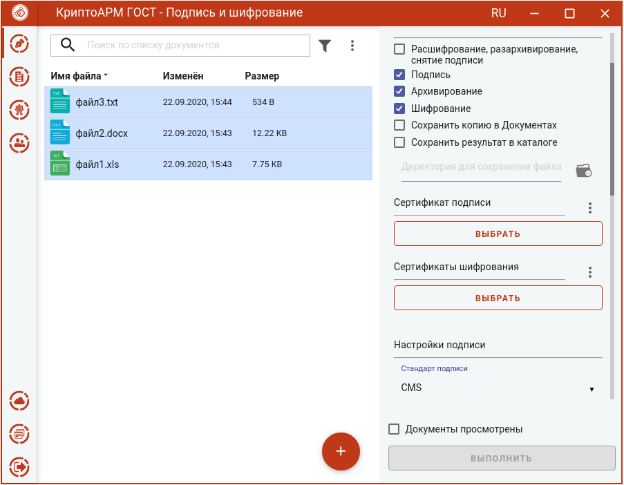
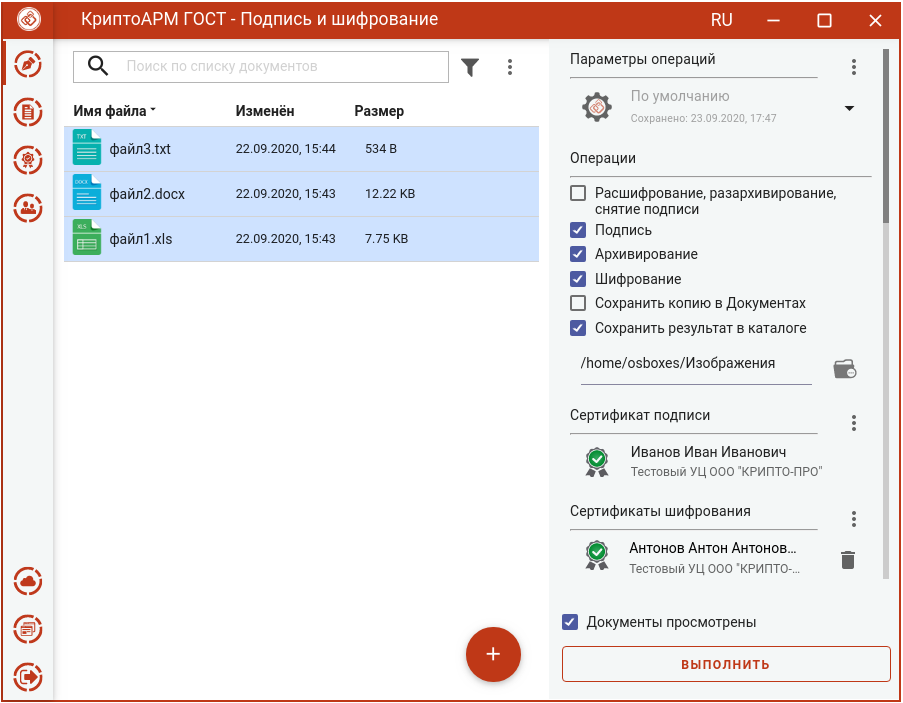
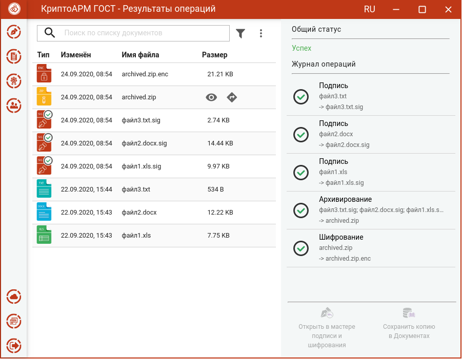
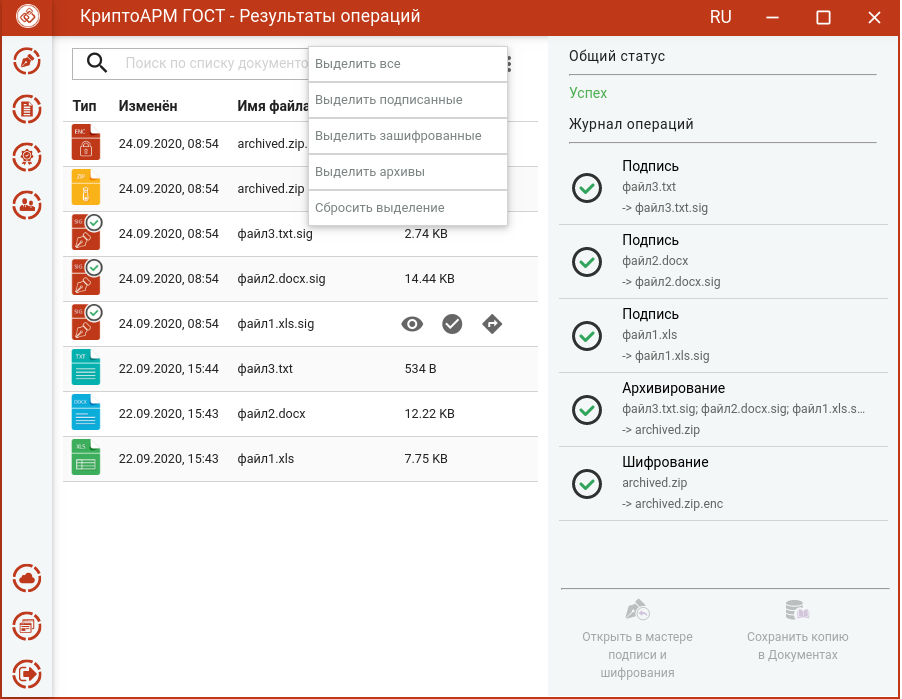

Для подписи, архивирования и шифрования файлов нужно в мастере **Подписи и шифрования** выбрать файлы, выбрать в разделе операций опции **Подпись,**  **Архивирование** и **Шифрование**, задать сертификат подписи, сертификаты получателей, параметры подписи и шифрования.

## Выбор файлов

В приложении доступно выполнение операций для одного или группы файлов. Файлы можно добавить двумя способами: через кнопку **Добавить (+)** или перетащив мышкой в область формирования списка файлов для операции.

Выбранные файлы заносятся в левую область и представляют собой одноуровневый список.

Для данного списка доступны поиск, фильтрация, управление файлами в списке через контекстное меню и кнопки для каждого файла.

## Установка параметров подписи и шифрования

В разделе **Операции** необходимо выбрать опции **Подпись,** **Архивирование** и **Шифрование,** становятся доступны настройки параметров подписи и шифрования.

В параметрах подписи можно настроить:

-   **Сертификат подписи** - сертификат, к которому привязан закрытый ключ. Выбор сертификата производится нажатием кнопки **Выбрать**. В появившемся диалоговом окне отображаются сертификаты категории **Личные**, которые могут использоваться для подписи.
-   **Стандарт подписи** – CMS для создания классической подписи или CAdES-X Long Type 1 для создания усовершенствованной подписи. При выборе стандарта CAdES-X Long Type 1 требуется заполнить поля в разделе **Служба штампов времени (TSP)** (подробнее в разделе **Создание усовершенствованной подписи**). Стандарт подписи CAdES-X Long Type 1 доступен только при установленном модуле КриптоПро TSP Client и КриптоПро OCSP Client.
-   **Вид подписи** – присоединённая или отсоединённая.
-   **Кодировка** - сохранение подписи в одной из двух кодировок BASE64 или DER. 
-   **Штамп времени на подпись** – предназначен для создания подписи со штампом времени на подпись. При установке флага требуется заполнить поля в   разделе **Служба штампов времени** (подробно в разделе **Создание подписи со штампом времени**). Данная опция доступна только при установленном модуле КриптоПро TSP Client.
-   **Штамп времени на подписанные данные** – предназначен для создания подписи со штампом времени на данные. При установке флага требуется заполнить поля в разделе **Служба штампов времени** (подробно в разделе **Создание подписи со штампом времени**). Данная опция доступна только при установленном модуле КриптоПро TSP Client.

В параметрах шифрования можно настроить:

- **Сертификаты шифрования** - сертификаты получателей. Выбор производится нажатием кнопки **Выбрать**. В появившемся диалоговом окне отображаются сертификаты категории **Личные** и категории **Сертификаты других пользователей (Контакты)**. В списке сертификатов допускается выбор нескольких сертификатов, так как число получателей может быть различным.
-   **Кодировка** - сохранение зашифрованного файла в одной из двух кодировок BASE64 или DER.
-   **Алгоритм шифрования** – файл шифруется по одному из алгоритмов: «ГОСТ 28147-89», «ГОСТ Р 34.12-2015 Магма», «ГОСТ Р 34.12-2015 Кузнечик». Данный параметр доступен для выбора только начиная с версии КриптоПро CSP 5.0.11635.
-   **Удалить файлы после шифрования** исходные файлы, над которыми выполняется операция шифрования, удаляются из файловой системы в случае  успешного завершения операции.

Можно задать каталог для сохранения полученных документов, выбрав в операциях опцию **Сохранить результат в каталоге.** При установке флага становится доступно поле выбора каталога. Если флаг не установлен, то файл сохраняется в папку пользователя.

Опция **Сохранить копию в Документах** служит для сохранения копии полученного после операции файла в специальный каталог Documents, расположенный в папке пользователя в каталоге ./Trusted/CryptoARM GOST/. Файлы из данного каталога доступны в пункте меню **Документы**.

Выбранные параметры можно сохранить и использовать при последующих запусках приложения. Процесс сохранения и изменения параметров описан в разделе **Управление параметрами операции**.

## Подпись, архивирование и шифрование файлов

При условии выбора сертификатов, файлов, установленного флага, что **Документы просмотрены**, в мастере становится доступной кнопка **Выполнить**.

Нажатие на кнопку **Выполнить** запускает процесс подписи, потом архивирования, а затем архив шифруется. Исходные документы (оригиналы), подписанные файлы, архив (промежуточные) и результат операции шифрования отображаются в отдельном мастере **Результаты операций.**

Если подписывается и архивируется несколько файлов, то архиву автоматически задается имя **archived.zip**. Если подписывается и архивируется один файл, то к имени файла добавляется расширение .sig.zip.enc.

Полученный файл сохраняется в каталоге, если в операциях был выбран каталог для сохранения результатов, или в папке пользователя. Подписанные файлы и архив сохраняется во временную папку TEMP, расположенную в домашней папке пользователя в каталоге ./Trusted/CryptoARM GOST/, и остается до выполнения следующей операции.

Если в операциях был установлен флаг **Сохранить копию в Документах**, то копия полученного после операции файла сохраняется в специальный каталог Documents, расположенный в папке пользователя в каталоге ./Trusted/CryptoARM GOST/. Файлы из данного каталога доступны в пункте меню **Документы**.

Если в параметрах шифрования была выбрана опция **Удалить файлы после шифрования**, то в **Результатах операций** будет только полученный зашифрованный файл, исходные и промежуточные будут удалены.

Для списка документов доступны поиск, фильтрация, выделение по типу операции. Для каждого файла доступны просмотр, переход в папку, а для подписанных файлов – проверка подписи.

Документы из **Результатов операций** можно **Открыть в мастере Подписи и шифрования** для выполнения других операций или **Сохранить копию в Документах**. Операция **Сохранить копию в Документах** служит для сохранения копии полученного после операции файла в специальный каталог Documents, расположенный в папке пользователя в каталоге ./Trusted/CryptoARM GOST/. Файлы из данного каталога доступны в пункте меню **Документы**.

После выполнения операции мастер **Подписи и шифрования** очищается от добавленных в него файлов. Результаты операций сохраняются до выполнения следующей операции или до закрытия приложения и доступны в меню **Подпись и шифрование - Результаты операций**.
