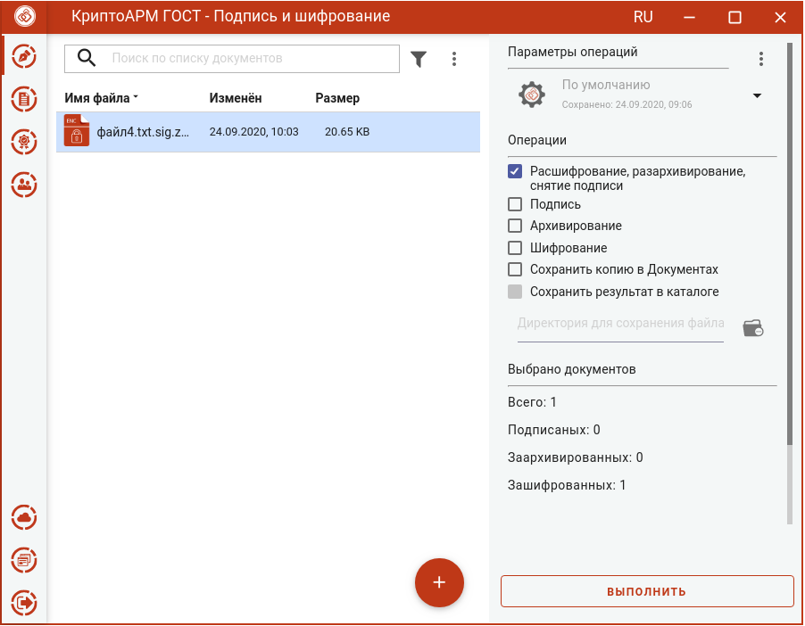
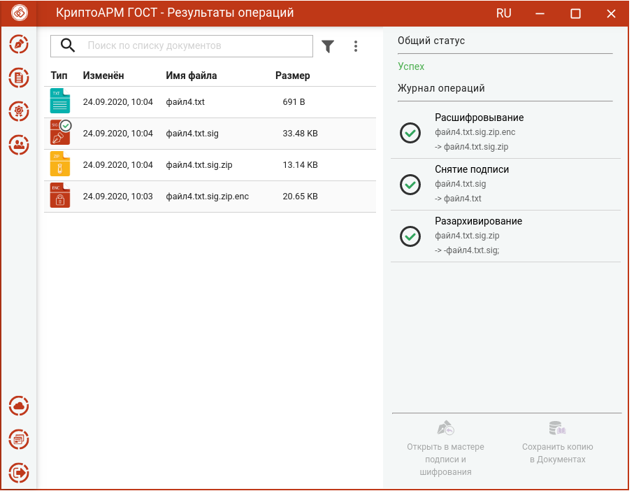

Для расшифрования, разархивирования и снятия подписи достаточно выбрать зашифрованный архив, содержащий подписанные файлы (с расширением **.sig.zip.enc)**, выбрать операцию **Расшифрование, разархивирование, снятие подписи** и нажать на кнопку **Выполнить**. Если несколько подписанных файлов были упакованы в архив и зашифрованы, то выбирается зашифрованный архив с расширением **.zip.enc**.

Настройка дополнительных параметров для операции не требуется.

Исходный зашифрованный и полученные файлы отображаются в отдельном мастере **Результаты операций**.

**Внимание!** Документы, полученные в результате обратных операций (расшифрование, разархивирование, снятие подписи), сохраняются во временную папку, расположенную в папке пользователя в каталоге ./Trusted/CryptoARM GOST/TEMP, и остаются там до выполнения следующей операции. Далее временная папка очищается.

Документы из **Результатов операций** можно **Открыть в мастере Подписи и шифрования** для выполнения других операций или **Сохранить копию в Документах**. Операция **Сохранить копию в Документах** служит для сохранения копии полученного после операции файла в специальный каталог Documents, расположенный в папке пользователя в каталоге ./Trusted/CryptoARM GOST/. Документы из данного каталога доступны в пункте меню **Документы**.
