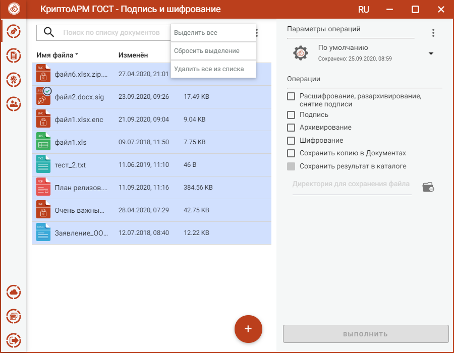
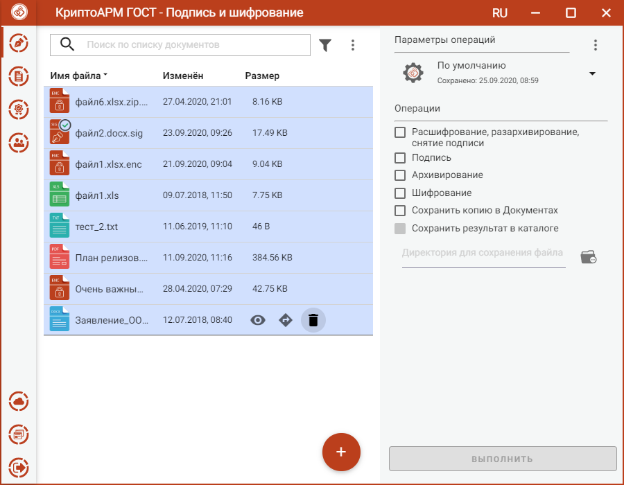
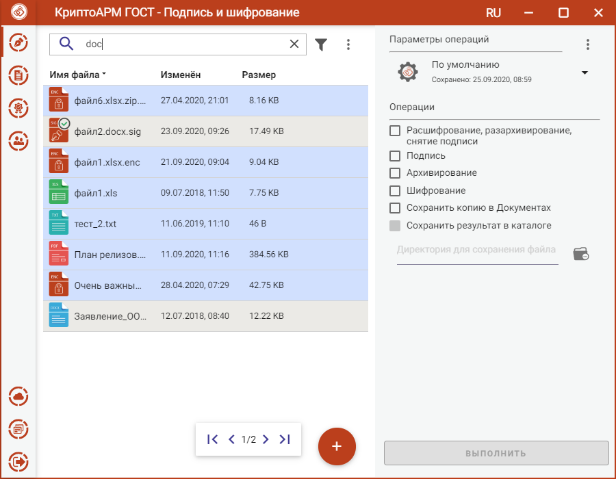
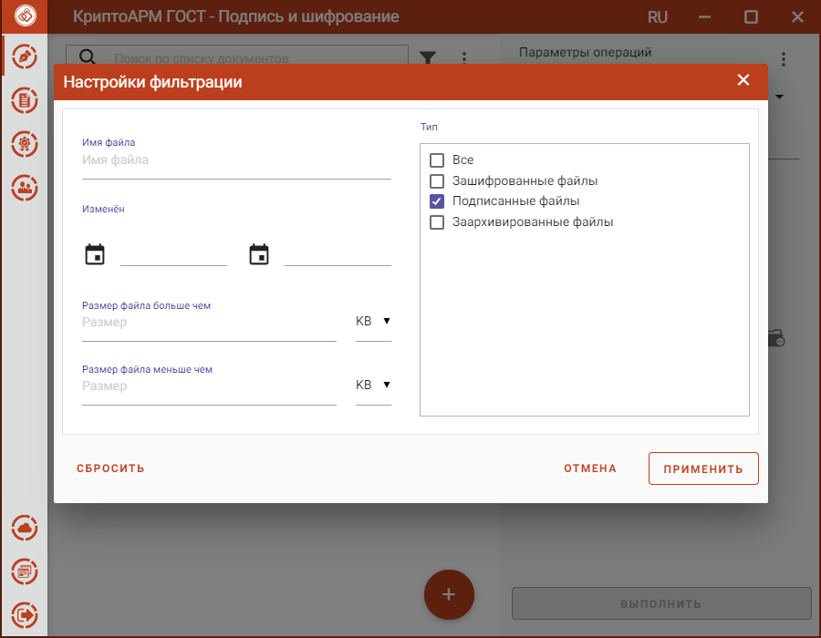
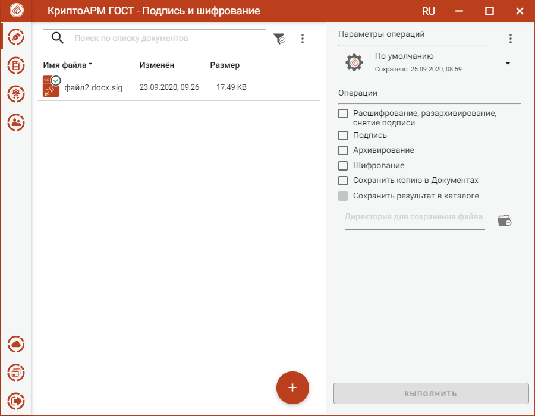

Список файлов для выполнения операций представляет собой одноуровневый список.

Файлы в список можно добавить двумя способами: через кнопку **Добавить(+)** или перетащив файлы мышкой в область формирования списка.

По умолчанию файлы в списке сортируются по дате создания - от новых к старым. Отсортировать файлы можно по любому столбцу, нажав на название столбца.

Для списка доступно контекстное меню, состоящее из пунктов:

-   **Выделить все** - выделяются все добавленные в список файлы;

-   **Сбросить выделение** - отменяется выделение всех выбранных в списке файлов;

-   **Удалить все из списка** - список очищается. При очистке списке файлы из файловой системы не удаляются.

Для каждого файла доступны кнопки операции, всплывающие при наведении на файл курсором мыши:

-   **Просмотр** - выполняется открытие файла через приложение, которое ассоциировано с его расширением;

-   **Перейти к файлу** - выполняется открытие каталога, в котором располагается файл.

-   **Проверить подпись** – доступна только для подписанных файлов Принудительно запускает процесс проверки подписи.

-   **Удалить** - файл удаляется из текущего списка. При выполнении этой операции файл остается в файловой системе.

В приложении реализован поиск файлов по символьному совпадению.

Список файлов можно отфильтровать, задав настройки фильтрации.

Применение фильтрации выполняется по нажатию кнопки **Применить**. В зависимости от выставленных критериев, в списке файлов остаются только те записи, которые удовлетворяют (суммарно) этим критериям.

Для сброса заданных критериев фильтрации служит кнопка **Сбросить** в окне
настроек фильтрации.