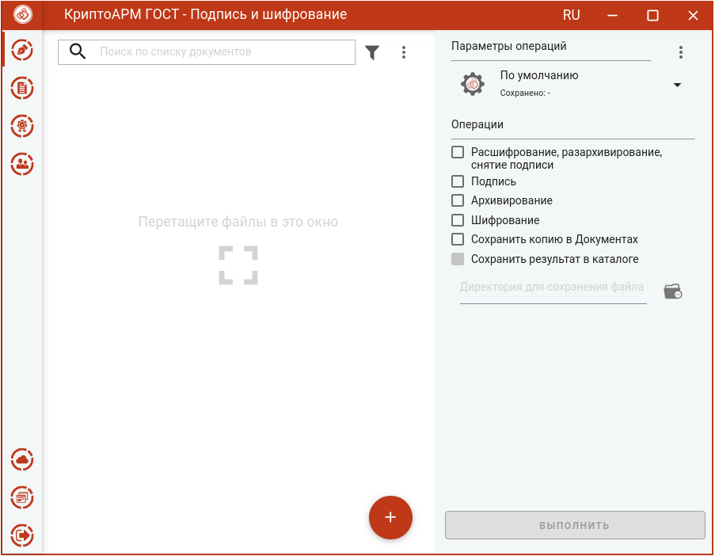
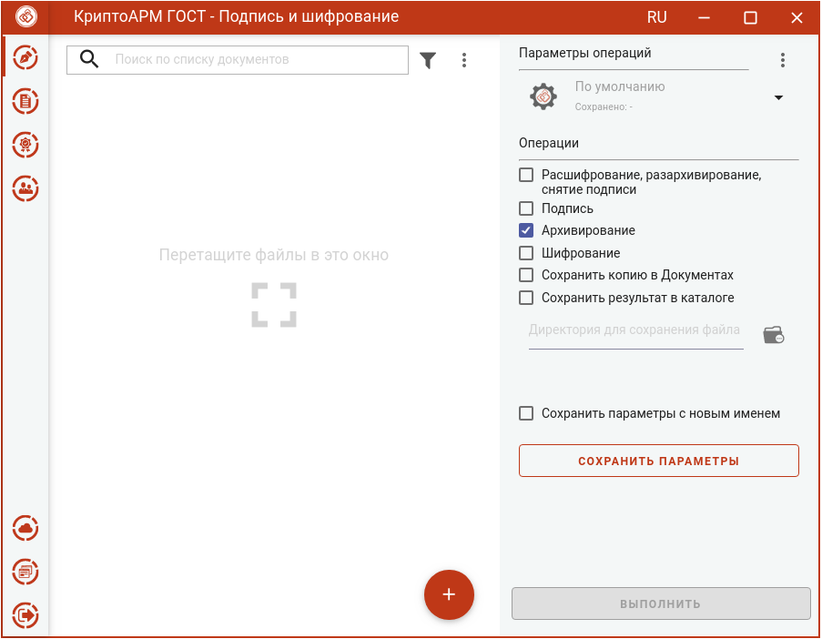
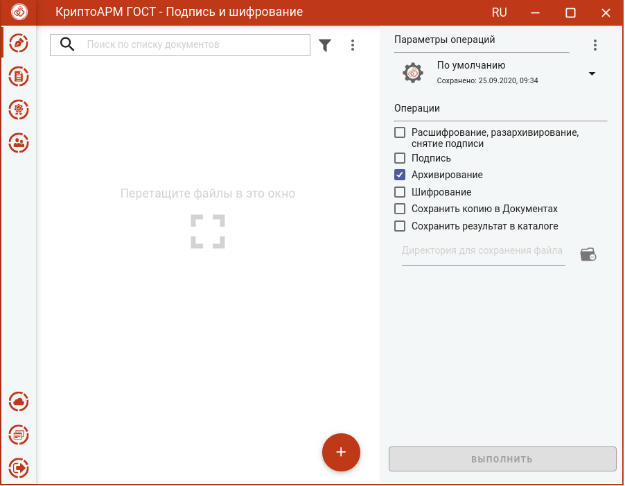
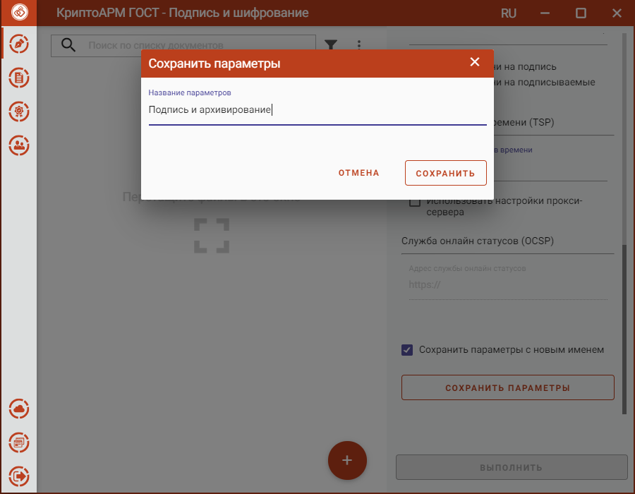
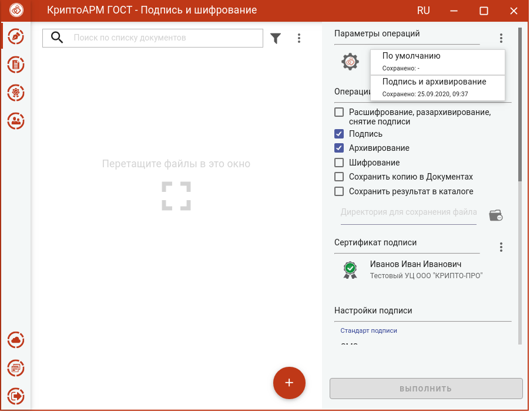
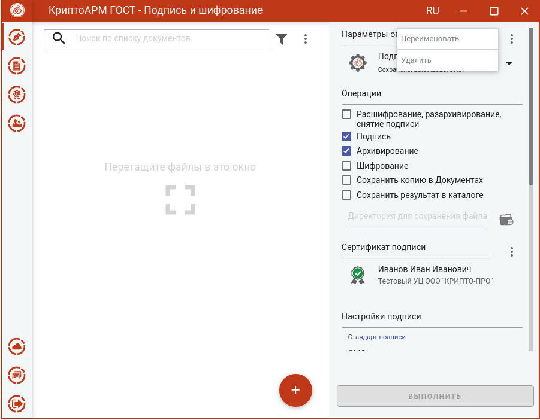
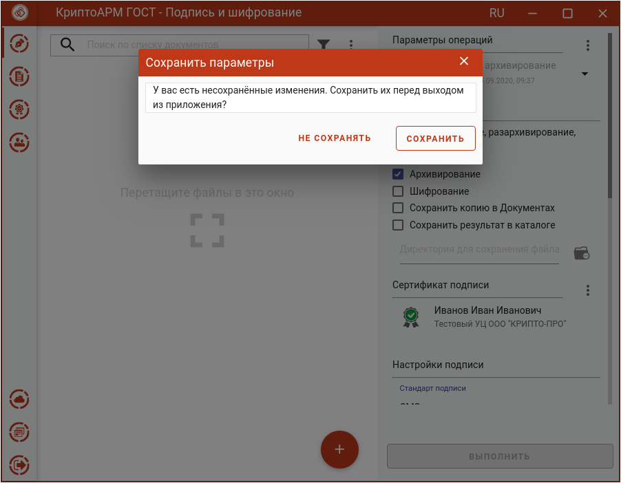

В мастере **Подписи и шифрования** выбранные операции и их параметры можно
сохранить и использовать при последующих запусках приложения, не устанавливая
каждый раз.

При первом запуске приложения создаются параметры **По умолчанию** с пустыми опциями операций и параметров операций.

При любом изменении опции операций или параметров операции становится доступна кнопка сохранения изменений **Сохранить параметры**.

При нажатии на кнопку происходит сохранение выбранных параметров в текущие параметры операций. Кнопка **Сохранить параметры** скрывается до изменений.

Если выбрать опцию **Сохранить параметры с новым именем** и нажать кнопку **Сохранить параметры**, то открывается окно ввода названия параметров операций.

По кнопке **Сохранить** происходит сохранение выбранных параметров с заданным именем. Выбрать параметры операций можно в выпадающем списке из ранее сохраненных параметров.

Можно настроить несколько параметров операций и выбирать нужные из списка.

**Параметры операций** можно переименовать или удалить через контекстное меню.

Если в **Параметрах операций** были сделаны изменения и не сохранены, то выбор других параметров выпадающего списка заблокирован. При закрытии приложения появляется окно с предложением сохранить сделанные изменения, сбросить изменения или закрыть без сохранения.

