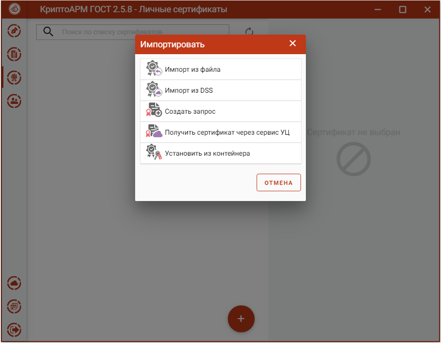
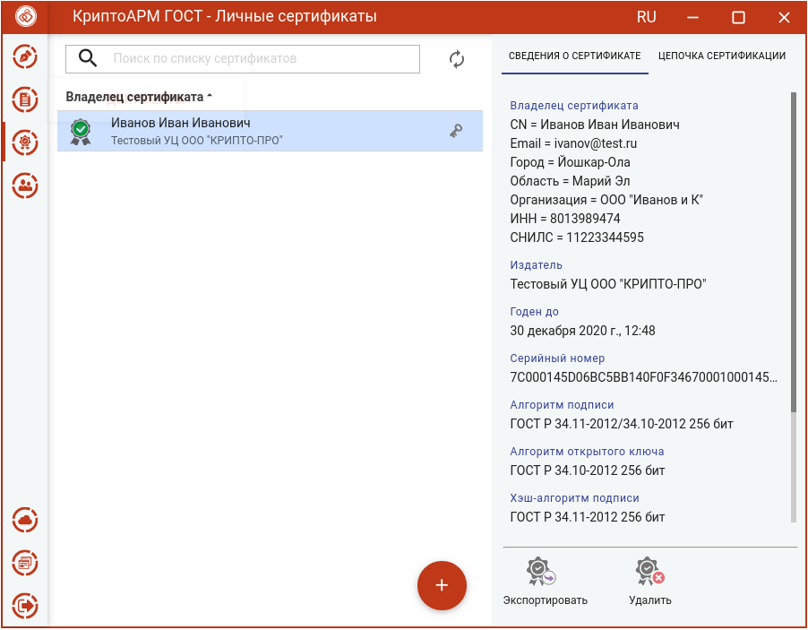
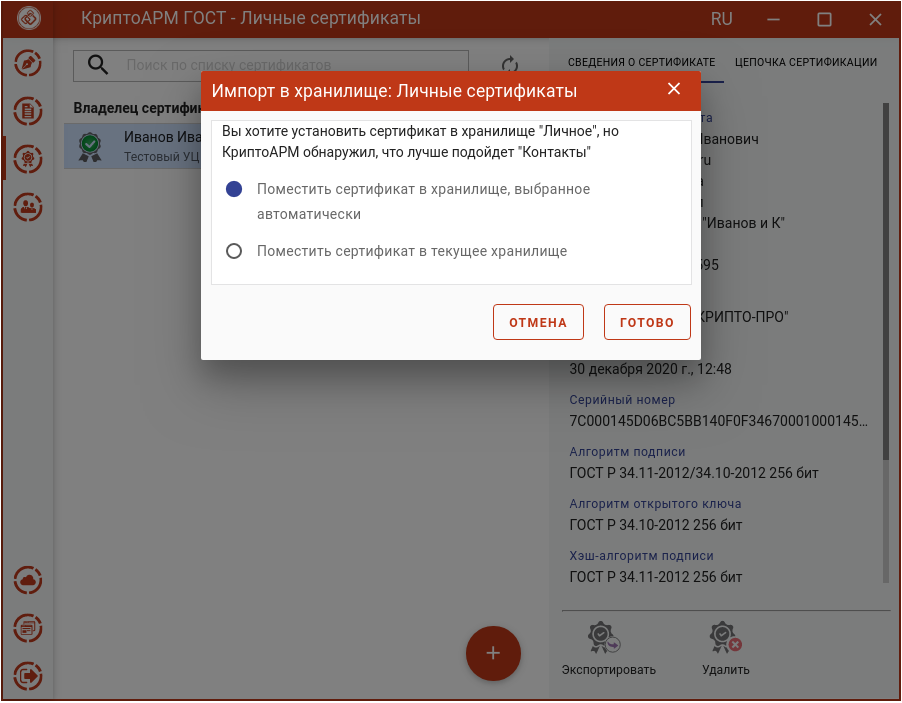
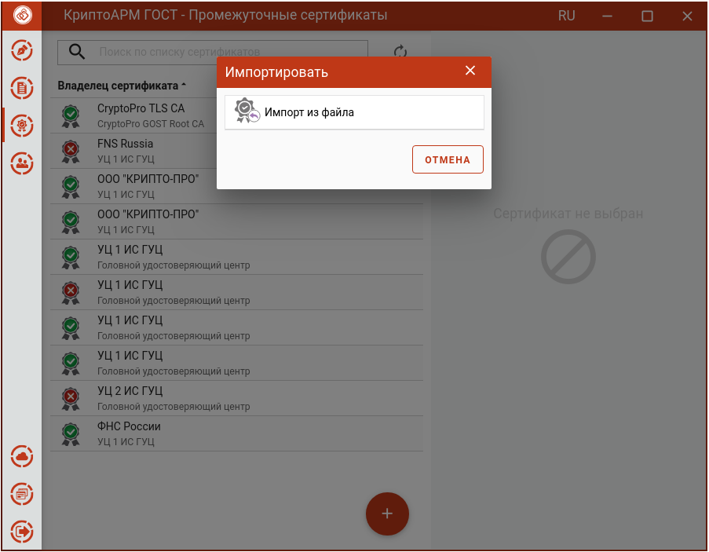
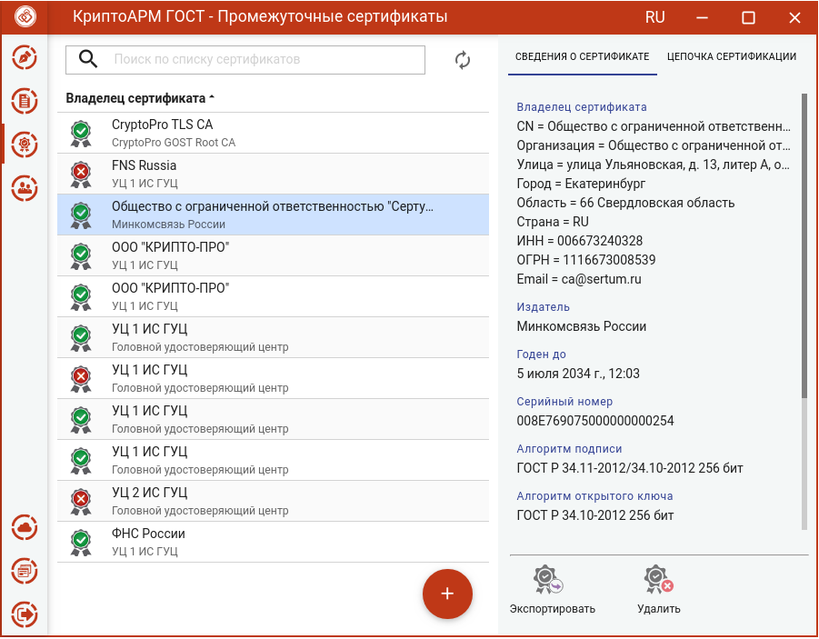
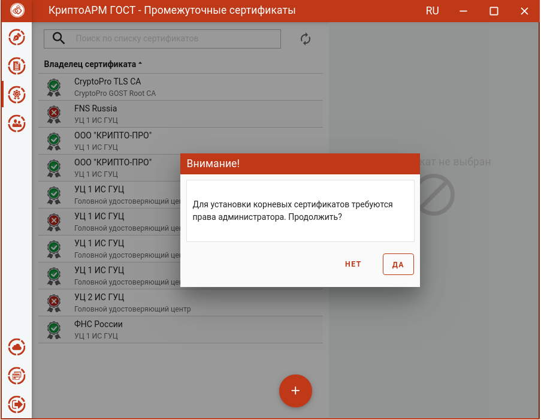

### Импорт сертификата из файла

   В приложении допускается импорт двух типов сертификатов:

-   **с привязкой к закрытому ключу** – pfx контейнер, содержащий сертификат и
    закрытый ключ. Или сертификат, который будет привязан к имеющемуся закрытому
    ключу в хранилище. Такие сертификаты устанавливаются в **Личное хранилище
    сертификатов** и их можно использовать для подписи и расшифрования .

-   **без привязки к закрытому ключу** – обычный сертификат, который
    устанавливается в хранилище промежуточных или корневых сертификатов для
    построения цепочки. Или в хранилище сертификатов других пользователей
    (**Контакты**) для шифрования в адрес этого сертификата.

### **Импорт личного сертификата с привязкой к закрытому ключу** 

Импорт сертификата выполняется кнопкой **Добавить (+)** в соответствующем
разделе.

В открывшемся окне нужно выбрать операцию **Импорт из файла**.

В открывшемся файловом менеджере нужно выбрать файл сертификата. Это может быть
файл формата pfx, содержащий ключевую пару (закрытый ключ и сертификат), или
обычный сертификат, у которого есть закрытый ключ в хранилище.

При успешном выполнении операции импорта сертификат автоматически помещается в
личные сертификаты.

Если при импорте не будет найден закрытый ключ, соответствующий сертификату, то
возникнет сообщение с предложением установить данный сертификат в подходящее
хранилище, или принудительно - в выбранное. Если сертификат без закрытого ключа
будет установлен в личное хранилище, то данным сертификатом нельзя будет
подписывать и расшифровывать файлы.

### **Импорт сертификата без привязки к закрытому ключу**

Импорт сертификата в хранилище выполняется кнопкой добавления сертификата
(**+**) и выбора опции **Импорт из файла**.

В открывшемся файловом менеджере нужно выбрать файл сертификата.

При успешном выполнении операции импорта, сертификат автоматически помещается в
выбранное хранилище.

При импорте промежуточных и корневых сертификатов нужны права администратора.

При нажатии на **Да** будет запрошен пароль администратора. Если выбрано
**Нет**, сертификат не импортируется.

Если при импорте приложение определило, что для данного сертификата лучше
подойдет другое хранилище, то возникнет сообщение с предложением установить
сертификат в подходящее хранилище или принудительно - в выбранное.

