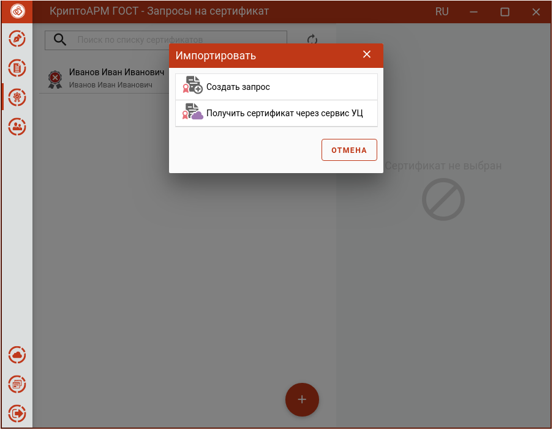
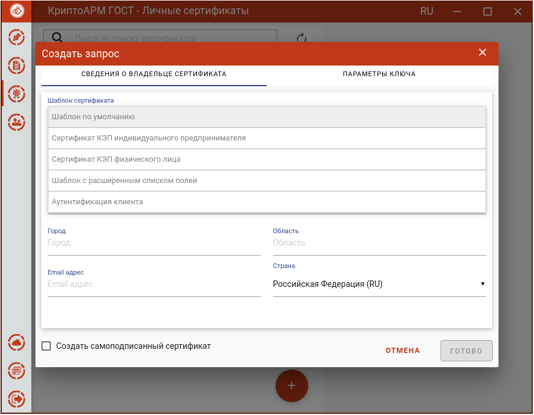
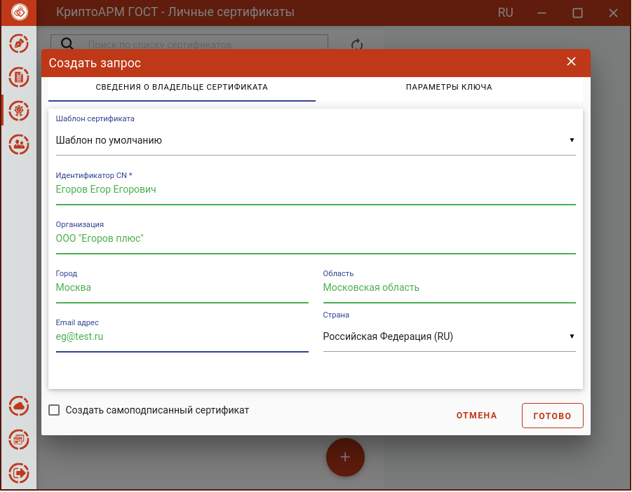
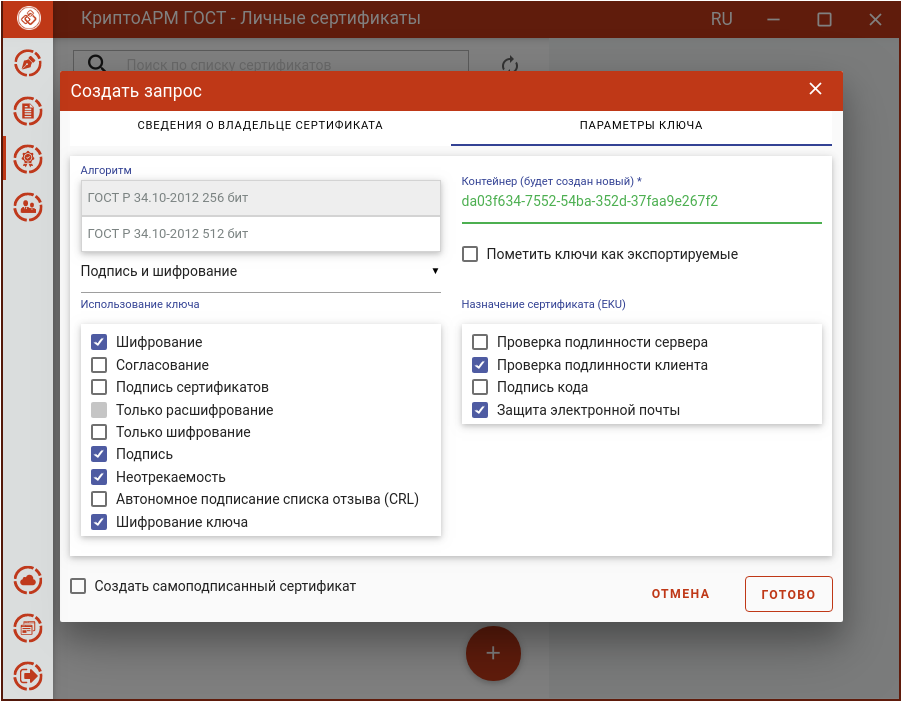
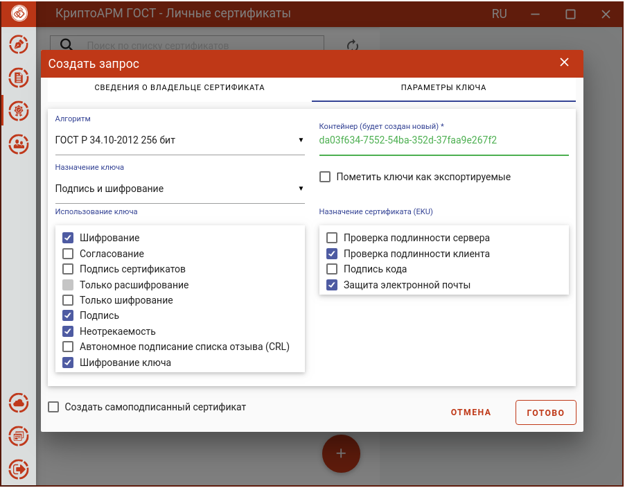
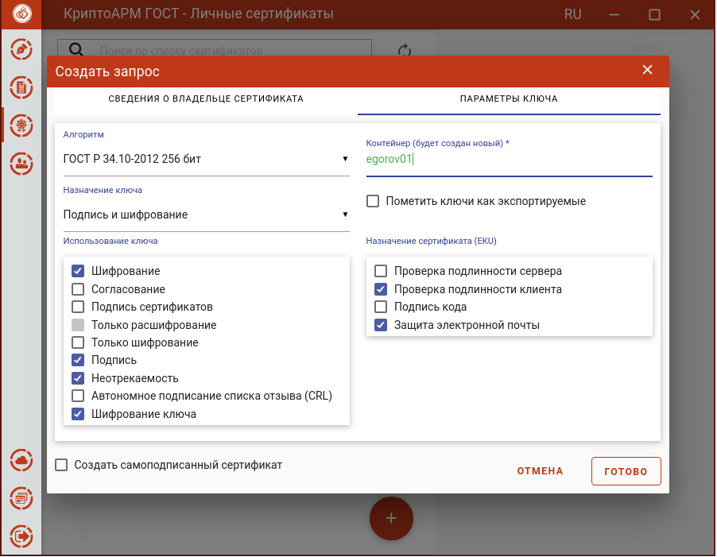
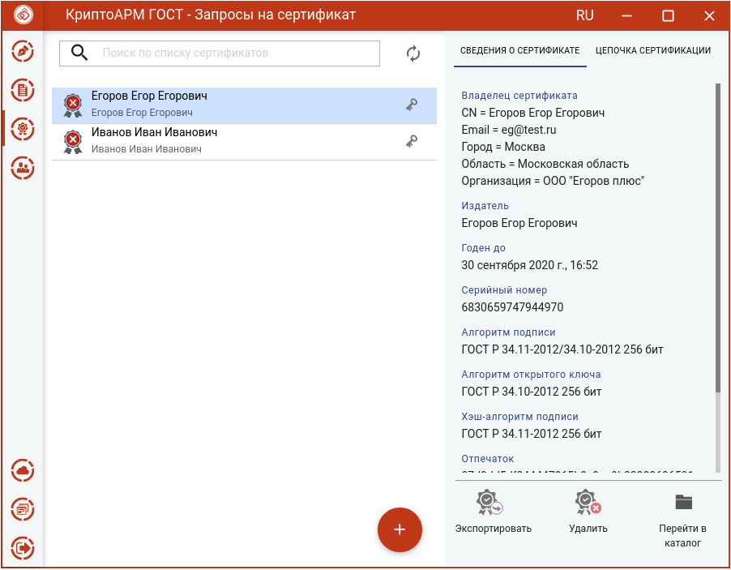

Создание запроса на сертификата выполняется в разделе **Сертификаты** по нажатию кнопки **Добавить (+)**.

Создать запрос можно со списка **Личных сертификатов**.

Или со списка запросов

Далее в окне добавления сертификата следует выбрать операцию **Создать запрос**.

Сбор необходимых данных для генерации запроса распределены на две вкладки: **Сведения о владельце сертификата** и **Параметры ключа**.

В **Сведениях о владельце сертификата** указывается:

-   Шаблон сертификата;

	

-   Основная информация, в которой, согласно выбранному на предыдущем шаге
    шаблону, необходимо указать идентификационную информацию о владельце
    сертификата.

	

-   Флаг **Создать самоподписанный сертификат** служит для создания сертификата и его автоматической установки в личное хранилище пользователя. Запросы на самоподписанные сертификаты не создаются.

В **Параметрах ключа** указывается:

-   Алгоритм ключа;

	

-   Назначение ключа;

	

-   Использование ключа;

	

-   Контейнер - будет создан на основе нового ключевого набора. Можно задать свое имя ключевого набора или оставить созданное автоматически.

	

-   Пометить ключи как экспортируемые. Если отметить этот флаг, то можно проводить экспорт сертификата вместе с закрытым ключом.

-   Назначение сертификата (EKU).

На основе указанных данных по кнопке **Готово** будет сформирован запрос на сертификат. Для сертификата выберите ключевой носитель для хранения контейнера (Реестр, диск, токен). На запрос системы установите пароль на данный контейнер и подтвердите его. После завершения операции возникнет окно с информацией об ее результатах

Запрос сохраняется в файл \<CN сертификата\>\<алгоритм \>\<дата генерации\>.req в папке пользователя в каталоге \.Trusted\\CryptoARM GOST\CSR и отображается в подпункте **Запросы** раздела **Сертификаты**.

Для запроса доступны следующие операции:

-   **Экспортировать** – для сохранения сертификата в файл;

-   **Удалить** – для удаления запроса из списка, при этом файл запроса не удаляется из папки;

-   **Перейти в каталог** – для открытия каталога в файловом менеджере, где располагается файл запроса.

Созданный файл запроса на сертификат следует направить на рассмотрение в Удостоверяющий центр (УЦ). Полученный из УЦ сертификат следует импортировать для работы в приложении.
