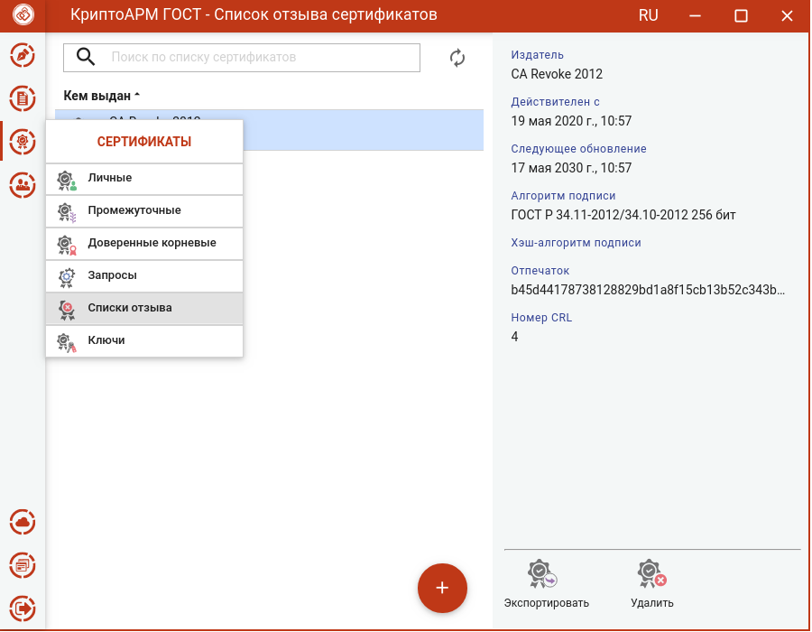
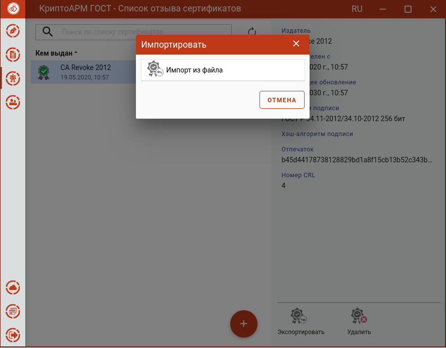
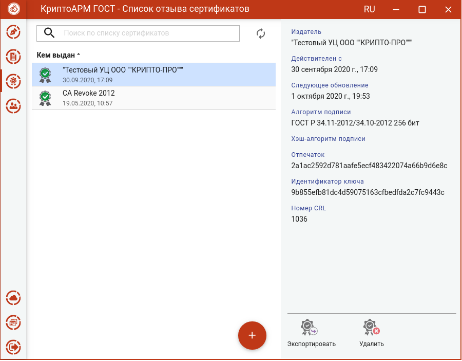
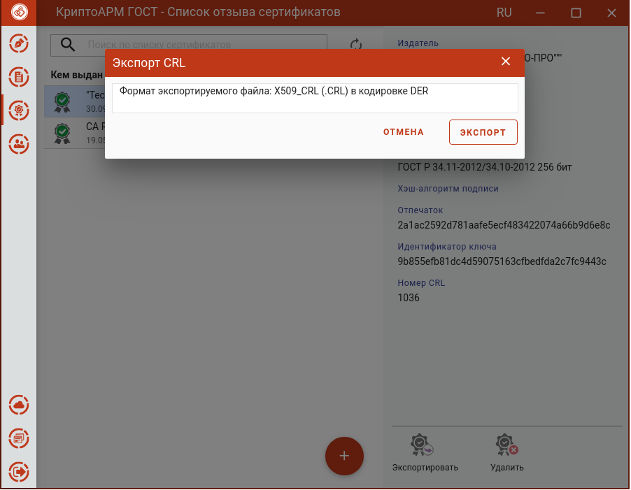
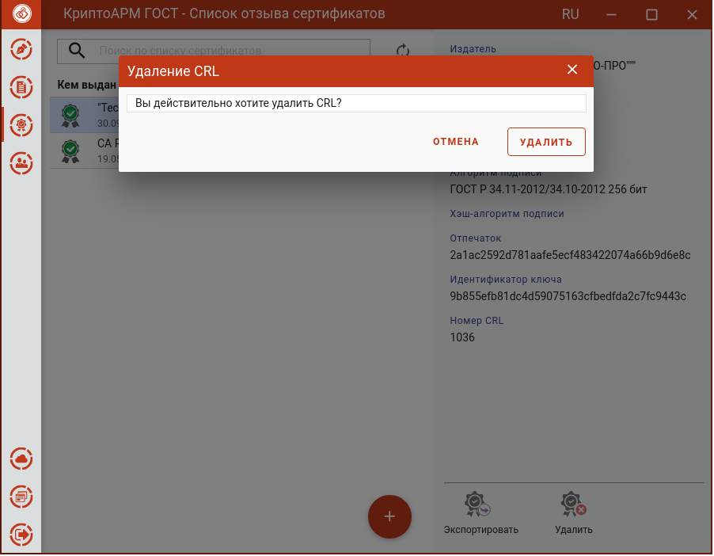

Для работы со списками отзыва сертификатов в пункт меню добавлен подпункт
**Списки отзыва**.

Списки отзыва можно импортировать, экспортировать и удалять.

### Импорт СОС

Для импорта списка отзыва надо нажать кнопку **Добавить (+)** и выбрать опцию **Импорт из файла** на любом списке сертификатов или СОС.

В открывшемся файловом менеджере выбрать файл списка отзыва. Может быть запрошен пароль администратора.

При успешном импорте СОС отображается в разделе **Список отзыва сертификатов**.

### Экспорт СОС. 

Для экспорта в мастере **Список отзыва** нужно выбрать СОС и нажать кнопку
**Экспортировать**. Открывается форма подтверждения экспорта.

При нажатии на **Экспорт** следует выбрать директорию для сохранения и задать имя файла СОС.

При успешном сохранении СОС в файл, появляется сообщение об этом.

### Удаление СОС. 

Для удаления в мастере **Список отзыва** нужно выбрать СОС и нажать кнопку
**Удалить.** Подтвердить удаление в соответствующем окне.

После успешного удаления появится сообщение об этом, СОС исчезнет из списка.
