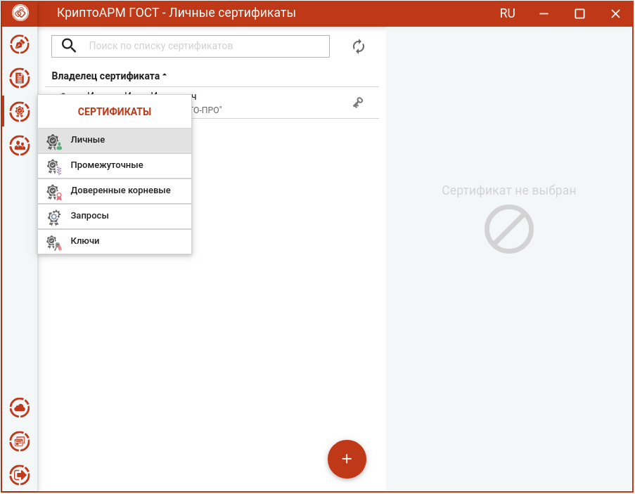
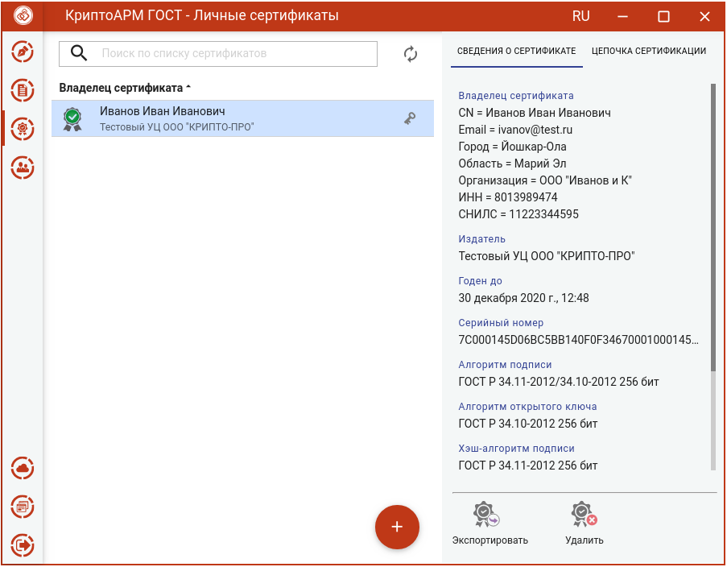
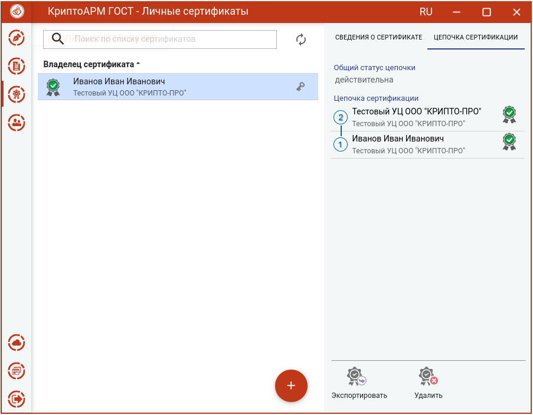

Цифровой сертификат представляет собой электронный документ, включающий открытый ключ и информацию о владельце данного ключа, заверенную электронной подписью Удостоверяющего Центра. 

Для управления сертификатами в приложении добавлен отдельный пункт меню **Сертификаты**. При выборе данного пункта открывается раздел со списком личных сертификатов и подменю с категориям сертификатов.

Подменю содержит пункты:

-   **Личные** – для управления сертификатами, у которых есть привязка к закрытому ключу;

-   **Промежуточные** - для управления промежуточными сертификатами;

-   **Корневые доверенные** - для управления доверенными корневыми сертификатами;

-   **Запросы** – для управлениями запросами на сертификат;

-   **Списки отзыва** – для управления списками отзыва сертификатов;

-   **Ключи** – для отображения ключевых контейнеров.

В левой области представления отображается список сертификатов выбранного раздела, в правой области отображается информация о выделенном сертификате.

При отображении сертификатов, они проверяются на корректность (математическая корректность и построение цепочки доверия).

Если к сертификату привязан закрытый ключ, то отображается знак ключа. Облачные сертификаты выделены знаком "облака".

Возможно появление одного из двух статусов проверки сертификата: корректный и некорректный.

На вкладке **Цепочка сертификации** отображается общий статус цепочки и "дерево" сертификатов.

