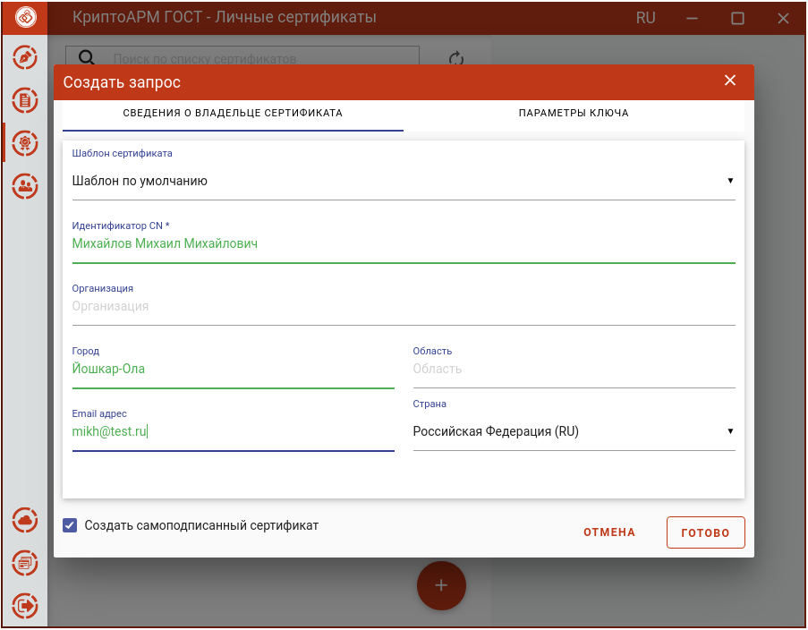
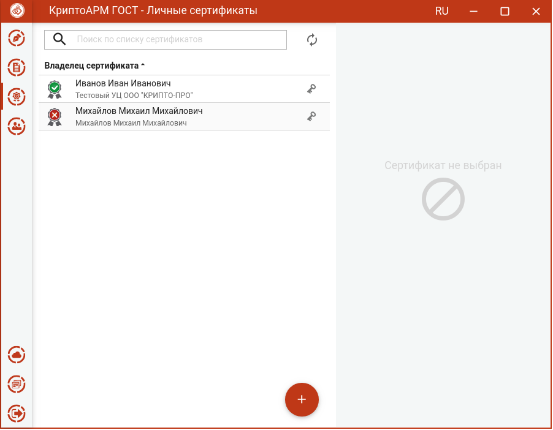

Создание самоподписанного сертификата выполняется так же, как создание запроса на сертификат (подробнее в разделе **Создание запроса на сертификат**), за исключением некоторых шагов.

Для создания самоподписанного сертификата на форме **Создать запрос** следует поставить флаг **Создание самоподписанного сертификата**. Создание запроса описано в разделе **Создание запроса на сертификат**.

На основе указанных данных по кнопке **Готово** будет сформирован самоподписанный сертификат. Для сертификата выберите ключевой носитель для хранения контейнера (Реестр, диск, токен). На запрос системы установите пароль на данный контейнер и подтвердите его. После завершения операции возникнет окно с информацией о ее результатах. Сертификат будет в списке **Личных сертификатов.**

Чтобы самоподписанный сертификат был действительным, нужно импортировать его в хранилище **Доверенных корневых**. Для этого сначала необходимо сертификат экспортировать в файл (подробно в разделе **Экспорт сертификата в файл**), а потом импортировать (подробно в разделе **Импорт сертификатов**).

При генерации самоподписанного сертификата запрос на сертификат не создается.
