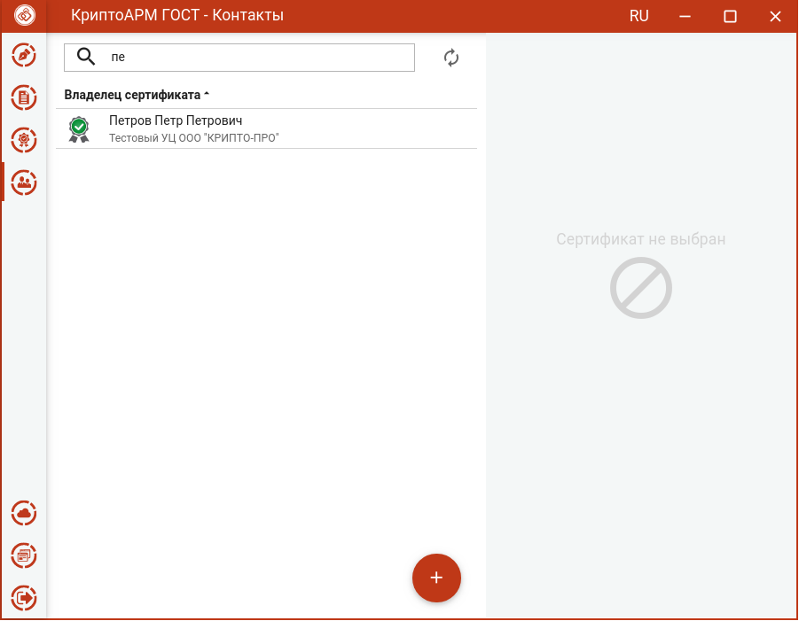

Для списка **Контактов** реализован поиск по ключевой фразе. Для этого надо в
строке поиска ввести критерий поиска.

Поиск реализован на основе совпадения ключевой фразы с любым текстовым свойством сертификата. В результате вместо полного списка в окне остаются только контакты, удовлетворяющие критерию поиска.

Чтобы отменить фильтр поиска требуется удалить ключевую фразу или нажать на
кнопку **Отмена (х)**.

**Примечание.** В случае неправильно указанного критерия поиска список контактов может оказаться пустым, о чем будет свидетельствовать надпись - Сертификаты отсутствуют.