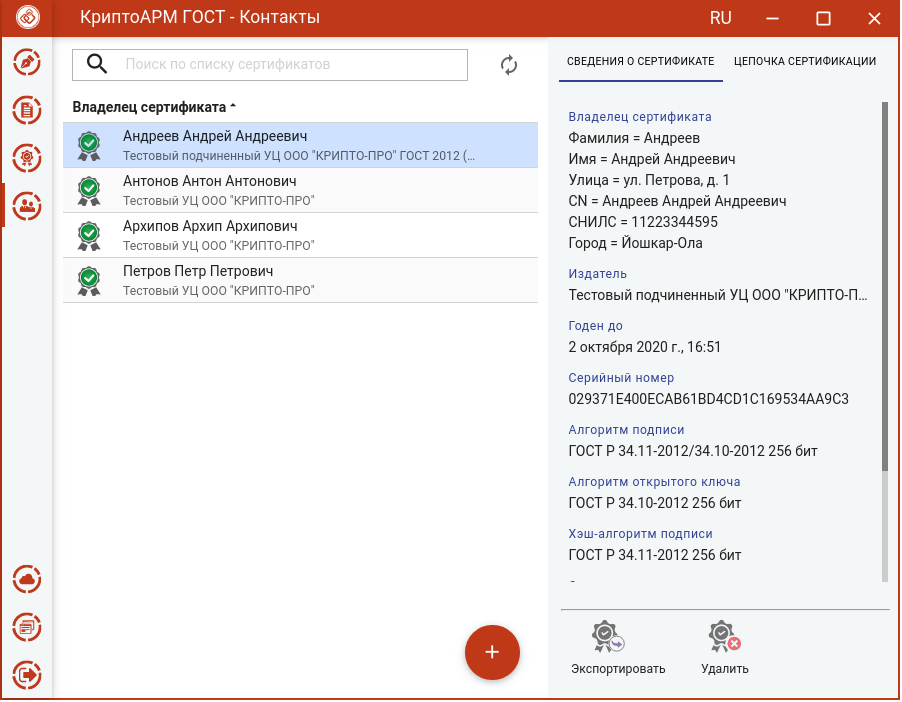
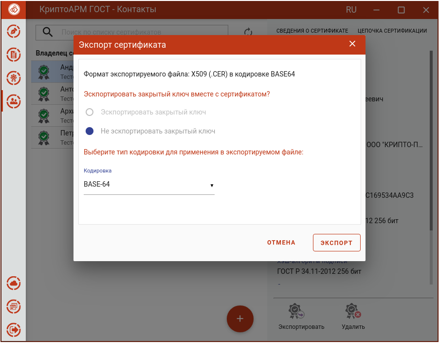

Для экспорта контакта в файл нужно в разделе **Конакты** выделить его в списке и нажать кнопку **Экспортировать**.

При экспорте появляется окно, в котором можно выбрать только кодировку файла сертификата.

После нажатия кнопки **Экспорт**, в открывшемся файловом менеджере указать путь и имя файла, куда будет сохранен сертификат (по умолчанию, файл export.cer).

По окончании операции возникнет сообщение об успешном экспорте сертификата.
