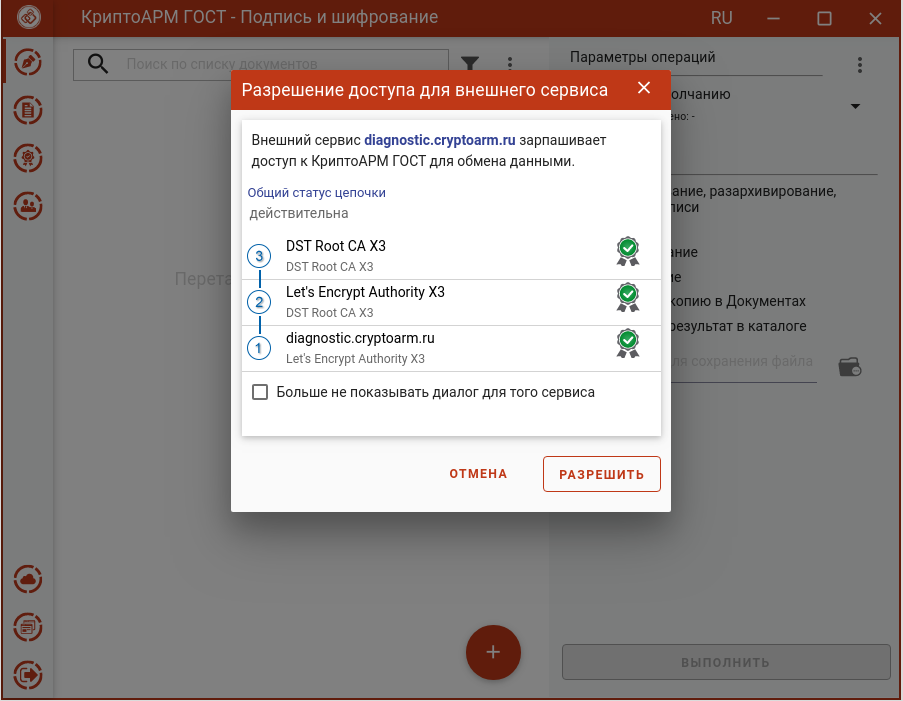
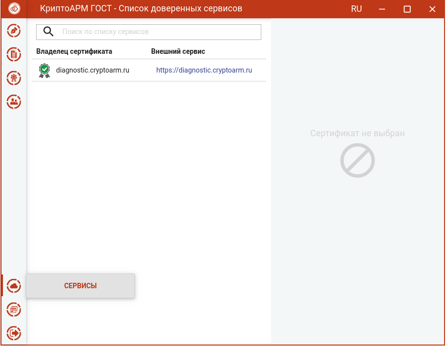

Приложение КриптоАРМ ГОСТ может открываться по зарегистрированной ссылке из
браузера для выполнения запросов сайта. Для того, чтобы ограничить доступ
нежелательных сайтов к приложению, при открытии КриптоАРМ ГОСТ с внешних ресурсов отображается окно с разрешением.

По нажатию кнопки **Разрешить** приложение готово для выполнения запросов
сервиса.

При отмене или закрытии окна разрешения обмен данными между внешним сервисом и приложением не выполняется.

При установке флага **Больше не показывать диалог для этого сервиса** и нажатию кнопки **Разрешить** доменное имя сервиса и сертификат сохраняются в список доверенных сайтов. При последующем обращении к КриптоАРМ ГОСТ с этого сайта окно разрешения доступа открываться не будет.

Если сертификаты в цепочке недействительные или цепочка не построилась, то
ответственность за разрешение возлагается на пользователя. Для построения действительной цепочки надо установить корневой и промежуточные сертификаты сервиса в соответствующие хранилища.

Список доверенных сайтов доступен через пункт меню **Сервисы**.

