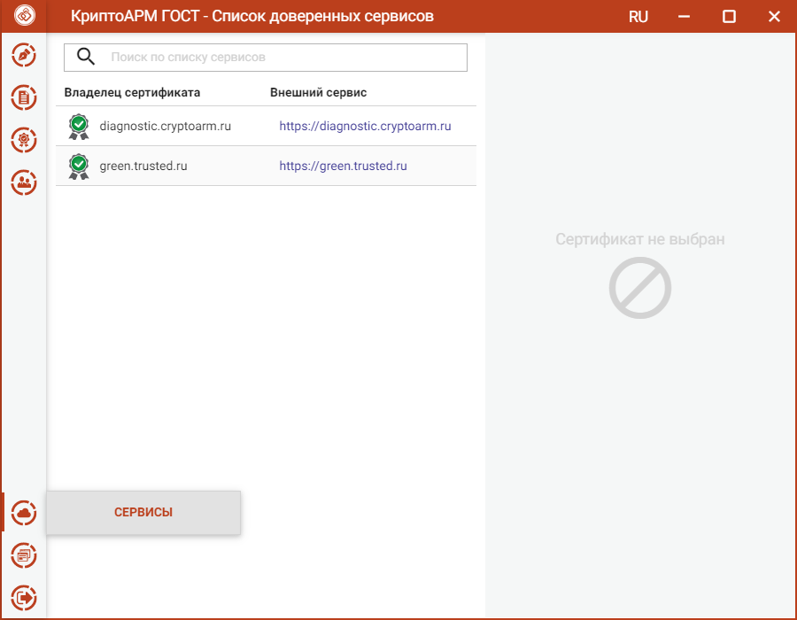
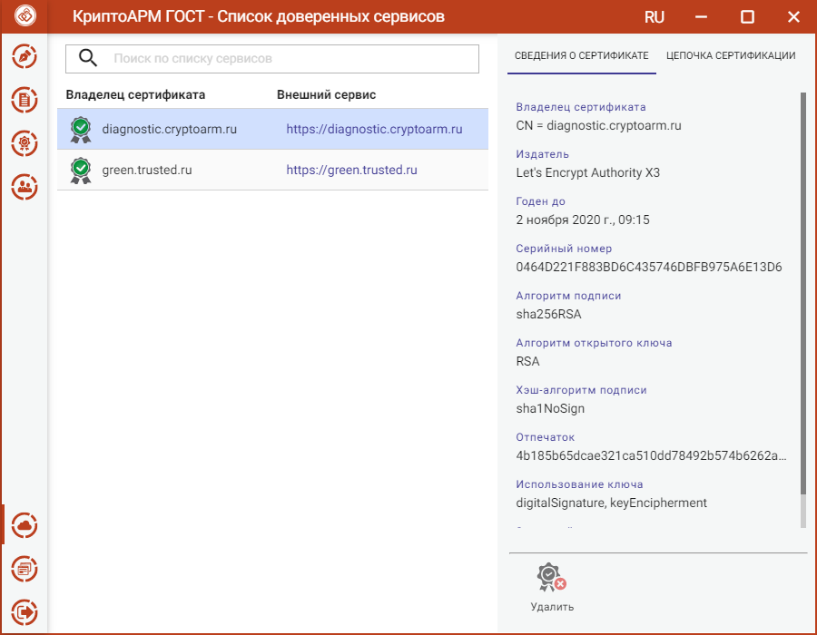
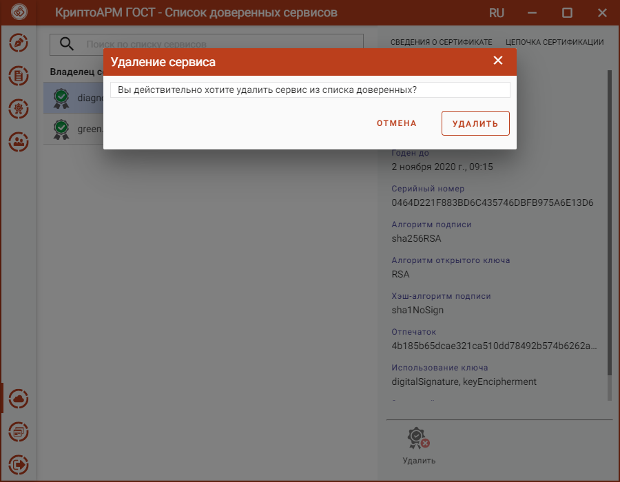
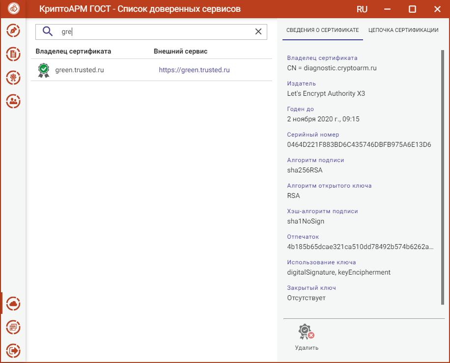

Если, при вызове КриптоАРМ ГОСТ по зарегистрированной ссылке из браузера, разрешение для данного сайта было запомнено, то доменное имя сервиса и сертификат сохраняются в список доверенных сайтов. Список доступен из меню **Сервисы**.

При выделении в списке сервиса отображается информация о его сертификате.

Сервис можно **Удалить**, нажав кнопку на форме просмотра. Открывается окно подтверждения удаления.

Для списка сервисов есть поиск по символьному совпадению. В списке отображаются только элементы, удовлетворяющие критериям поиска.

