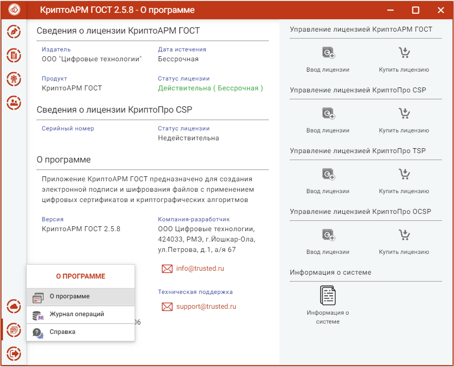

Пункт меню **О программе** содержит подпункты:

-   **О программе** – для отображения краткой информации о приложении и
    лицензиях;

-   **Журнал операций** – для отображения выполняемых операций в приложении;

-   **Справка** – для открытия полного руководства пользователя приложения.

