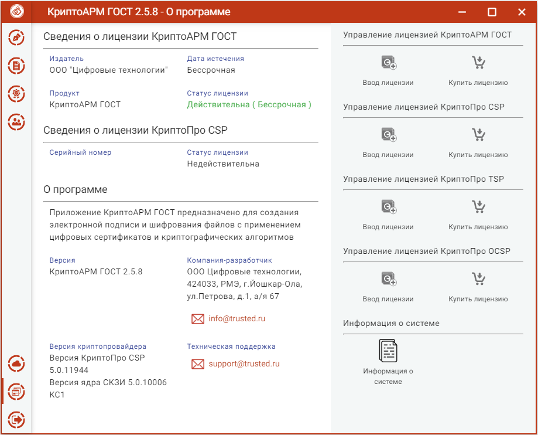
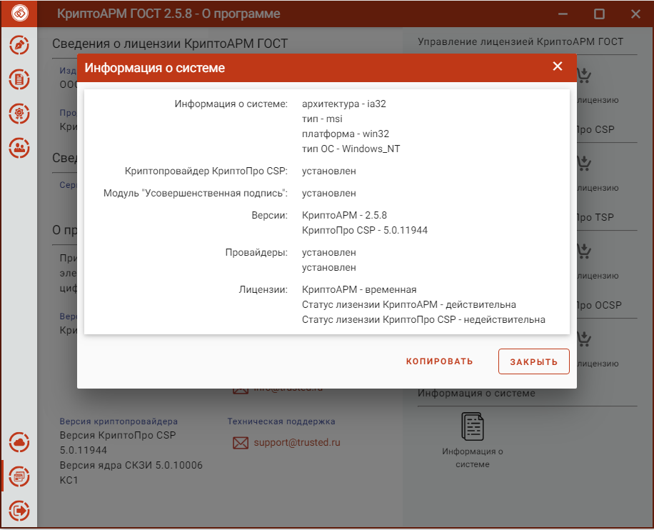

Краткие сведения о программе, лицензиях на КриптоАРМ ГОСТ и КриптоПро CSP, контактные данные компании - разработчика, а так же адрес электронной почты для
получения дополнительной технической поддержки, можно узнать, выбрав подпункт **О программе**.

**Информация о системе** необходима при обращении в техническую поддержку.

Для этого нужно скопировать информацию в буфер обмена кнопкой **Копировать** и вставить в текс обращения в техническую поддержку с описанием вопроса или проблемы.