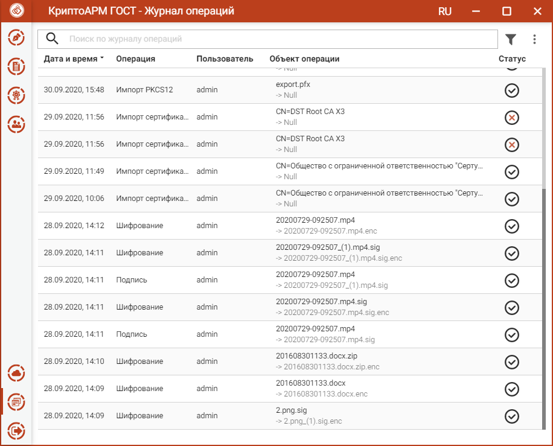
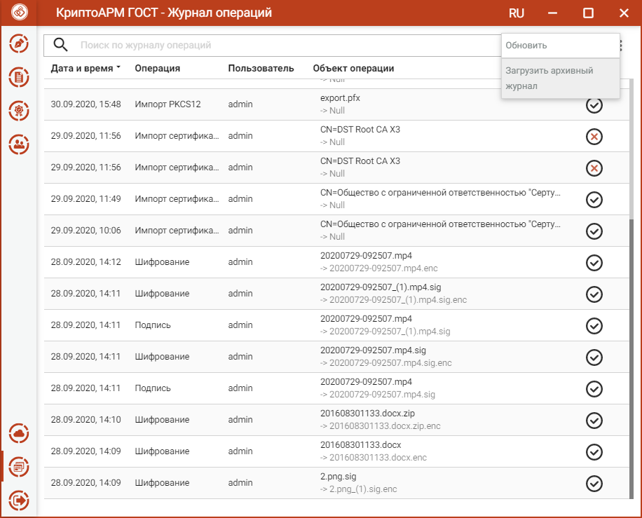
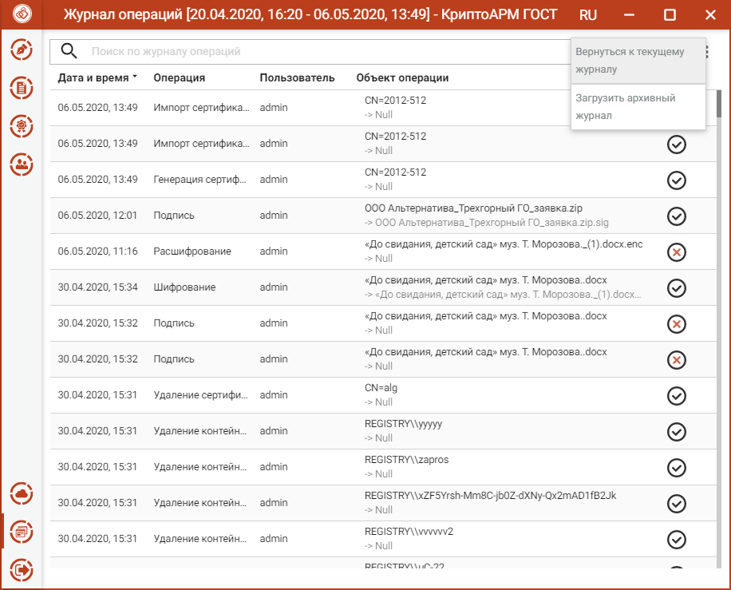
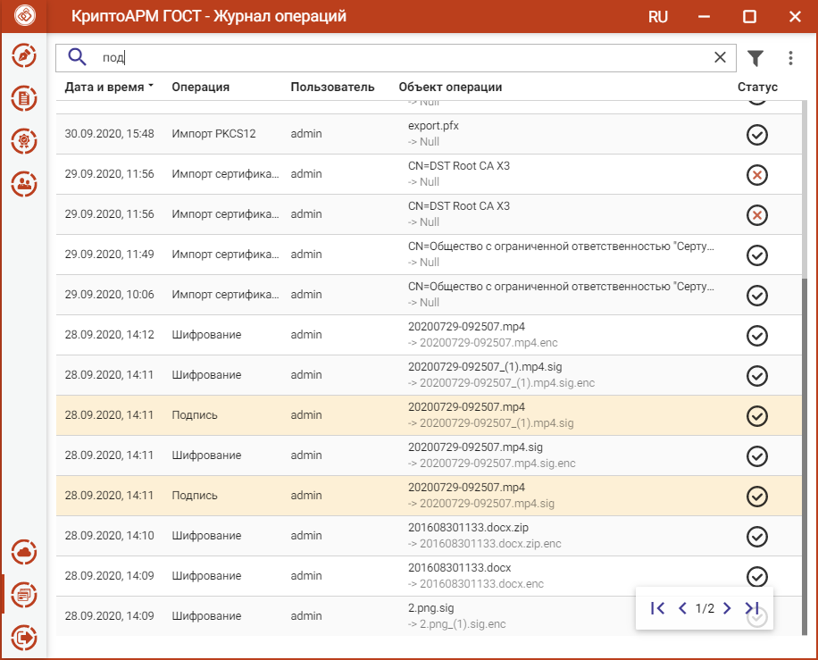
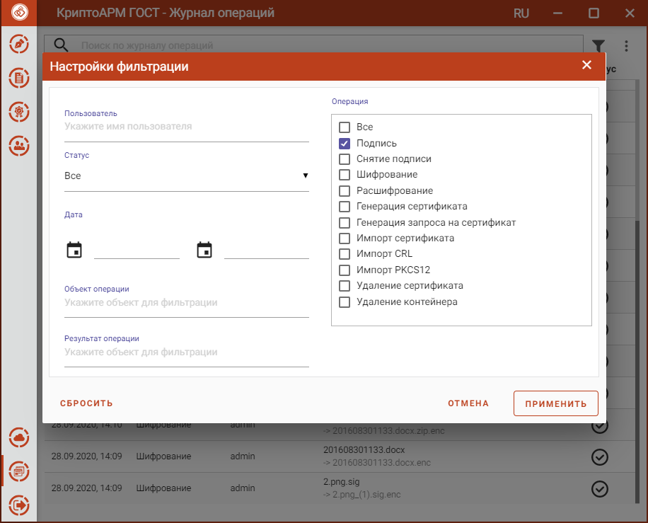
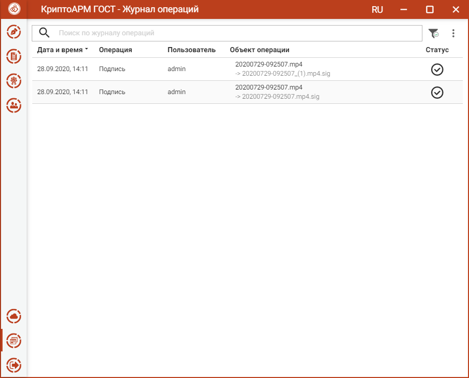

**Журнал операций** предназначен для отображения операций, выполняемых пользователем.

В журнале отображаются следующие типы операций:

-   подпись;

-   снятие подписи;

-   шифрование;

-   расшифрование;

-   генерация сертификата;

-   генерация запроса на сертификат;

-   импорт сертификата;

-   импорт сертификата в формате pkcs\#12;

-   удаление сертификата;

-   удаление контейнера.

Текущая версия **Журнала операций** записывается в файл cryptoarm_gost_operations[порядковый номер журнала].log, который находится в папке пользователя в каталоге .Trusted.

По мере накопления записей выполняется автоматический переход к новому файлу журнала со следующим порядковым номером.

При работе с журналом операций предусмотрен режим загрузки ранее сохраненного архива для просмотра, поиска и фильтрации записей. Для этого используется пункт **Загрузить архивный журнал** контекстного меню журнала.

По кнопке **Обновить** контекстного меню происходит обновление записей в **Журнале операций**.

Для возврата к текущему журналу операций используется пункт контекстного меню **Вернуться к текущему журналу.**

## Поиск записей в журнале операций

В приложении реализован поиск записей **Журнала операций** по символьному совпадению.

## Фильтрация журнала операций

Для открытия окна настроек критериев фильтра на панели управления имеется кнопка, при нажатии на которую открывается окно настроек фильтрации.

Применение фильтрации выполняется по нажатию кнопки **Применить**. В зависимости от выставленных критериев фильтра, в журнале остаются только те записи, которые удовлетворяют (суммарно) этим критериям.

Для сброса заданных критериев служит кнопка **Сбросить** в окне настроек фильтрации.

