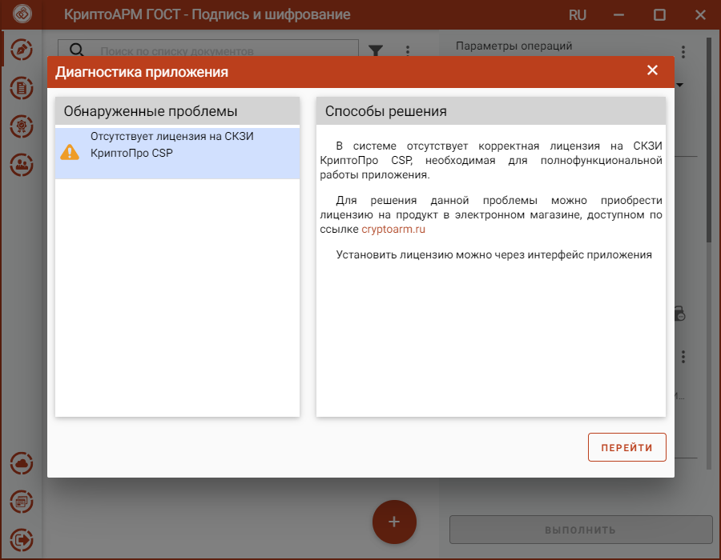

Без установленной лицензии на программный продукт КриптоПро CSP при запуске
приложения возникает предупреждающее сообщение.

По кнопке **Перейти** происходит переход на вкладку **О программе**, где можно установить лицензию.

При закрытии мастера диагностики приложение остается работоспособным, но с ограниченным функционалом. Без лицензии не будут выполняться операции, связанные с доступом к закрытому ключу (например, подпись и расшифрование).

Инструкция по установке лицензии в приложении КриптоПро CSP описана в разделе **Установка лицензии на программный продукт КриптоПро CSP**.