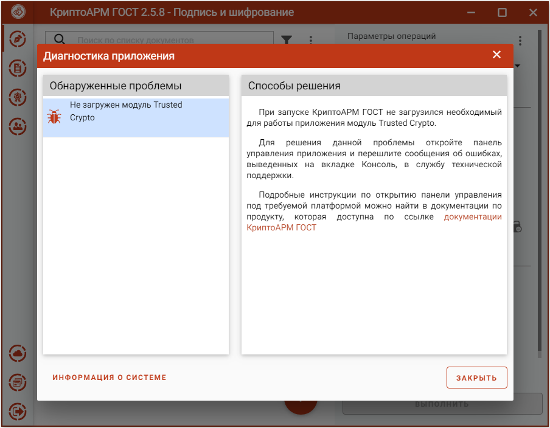

Приложение КриптоАРМ ГОСТ не работает без модуля Trusted Crypto. В таком случае при запуске приложения будет предупреждающее сообщение.

Дальнейшая работа приложения невозможна. Приложение можно только закрыть.

Для решения данной проблемы необходимо запустить приложение в консольном режиме, скопировать информацию об ошибке и связаться со специалистами технической поддержки продукта КриптоАРМ ГОСТ. Так же в текст обращения следует включить сведения о системе, скопировав ее нажатием на **Информацию о системе**.

Инструкция по включению консольного режима описана в разделе **Включение режима логирования и консоль управления** данного руководства.