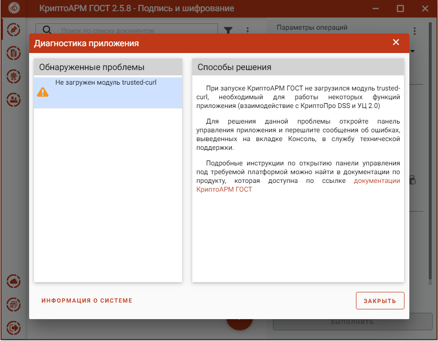

Приложение КриптоАРМ ГОСТ без модуля Trusted Crypto остается работоспособным. Без данного модуля невозможно использовать сертификаты DSS и получать сертификаты через КриптоПро УЦ 2.0.

Для решения данной проблемы необходимо запустить приложение в консольном режиме, скопировать информацию об ошибке и связаться со специалистами технической поддержки продукта КриптоАРМ ГОСТ. Так же в текст обращения следует включить сведения о системе, скопировав ее нажатием на **Информацию о системе**.

Инструкция по включению консольного режима описана в разделе **Включение режима логирования и консоль управления** данного руководства.
