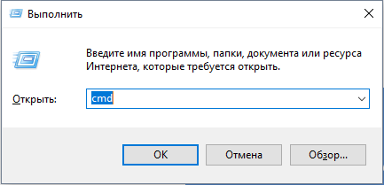

Для запуска командной строки нажать Win+R. Ввести команду cmd и ОК

В открывшемся окне ввести команду запуска приложения КриптоАРМ ГОСТ:

**"C:\\Program Files\\CryptoARM GOST\\cryptoarm-gost.exe" devtools logcrypto**

В результате выполнения этой команды откроется приложение КриптоАРМ ГОСТ с
дополнительной панелью управления и сохранением информации об операциях в журнал логирования.

При выполнении операции, приводящей к ошибке, в открывшемся дополнительном окне управления на вкладке Console отобразится текст ошибки.

Журнал логирования представляет собой текстовый файл cryptoarm_gost.log, который располагается в каталоге пользователя в папке .Trusted.