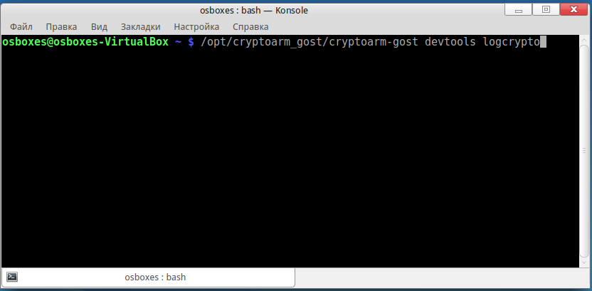
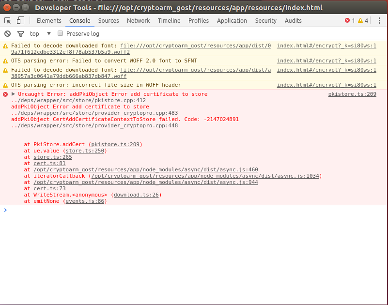

Для получения доступа к дополнительной панели управления приложением и
включением режима логирования, в терминале OC Linux нужно ввести команду:

**/opt/cryptoarm_gost/cryptoarm-gost devtools logcrypto**

При выполнении операции, приводящей к ошибке, в открывшемся дополнительном окне на вкладке Console отобразится текст ошибки.

При выполнении операции, приводящей к ошибке, в открывшемся дополнительном окне управления на вкладке Console отобразится текст ошибки.

Журнал логирования представляет собой текстовый файл cryptoarm_gost.log, который располагается в каталоге пользователя в папке .Trusted.
