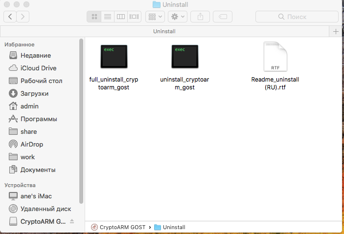

---
slug: "/post2"
title: "Удаление приложения на платформе MS Windows"
sort: "02"
--- 

1. Для удаления пакета через графический интерфейс нужно открыть двойным щелчком образ диска с дистрибутивом (dmg), а затем двойным щелчком каталог **Uninstall**, содержащий скрипты для удаления приложения. Для удаления приложения из каталога Application запускается **скрипт unistall_cryptoarm_gost**. Для полного удаления приложения (настроек, кэша) используется скрипт **full_uninstall_cryptoarm_gost**. Требуется ввод пароля администратора.

2. Для удаления приложения КриптоАРМ ГОСТ на операционной системе OS X можно воспользоваться менеджером Finder. В менеджере выбрать  вкладку **Программы** и найти приложение КриптоАРМ ГОСТ. Перетащить приложение КриптоАРМ ГОСТ в **Корзину**. Таким образом, приложение будет удалено из операционной системы.
