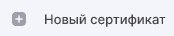

Чтобы получить личный сертификат для выполнения криптографических операций, необходимо создать запрос на сертификат и направить его на рассмотрение в Удостоверяющий центр (УЦ).

1. Перейдите в раздел **Сертификаты**.
2. Нажмите .
    Форма создания запроса на сертификат открывается в новой вкладке.
3. Выберите папку для сохранения запроса.   
    Если папка не выбрана, запрос сохранится в папку пользователя.
4. Выберите шаблон сертификата, открыв правую боковую панель со списком шаблонов.
5. Заполните поля раздела **Сведения о владельце**.
    Набор полей меняется в зависимости от  выбранного на предыдущем шаге шаблона.
6. Перейдите в раздел **Параметры ключа**.
    В данном разделе вы можете задать:
    - алгоритм ключа;
    - название ключевого контейнера - создан на основе нового ключевого набора, но вы можете задать свое имя или оставить созданное автоматически;
    - установить флаг **Пометить ключи как экспортируемые** - данная опция позволит экспортировать сертификат вместе с закрытым ключом для переноса на другое устройство;
    - использование ключа;
    - назначение сертификата (EKU).
7. Нажмите **Сохранить** после заполнения всех полей.  
8. Выберите ключевой носитель для хранения контейнера (реестр, диск, токен), если требуется.
9. На запрос системы установите пароль на данный контейнер и подтвердите его. 

На основе указанных данных формируется запрос на сертификат.  

При успешной генерации запрос сохраняется в файл \<CN сертификата\>_\<алгоритм \>_\<дата генерации\>.req в заданной папке и отображается в подпункте **Запросы** раздела **Сертификаты**.

Созданный файл запроса на сертификат следует направить на рассмотрение в Удостоверяющий центр (УЦ). Полученный из УЦ сертификат следует импортировать для работы в приложении.

Если создании запроса возникает ошибка, она выводится как уведомление в правом верхнем углу. Вы можете посмотерть уведомления, нажав на иконку . Для просмотра подробного описания ошибки или отправки в техническую поддержку нажмите  в правой боковой панели списка уведомлений.

**ИНСТРУКЦИИ ПО ТЕМЕ:**  
1. [Как установить корневой и промежуточный сертификаты.](https://docs.cryptoarm.ru/v3.0-Beta/005-certs/import-UC-certs)  
2. [Как импортировать список отзыва сертификатов (СОС).](https://docs.cryptoarm.ru/v3.0-Beta/005-certs/import-crl)  
4. [Как установить личный сертификат.](https://docs.cryptoarm.ru/v3.0-Beta/005-certs/import-my-cert)  
5.  [Как посмотреть уведомления.](https://docs.cryptoarm.ru/v3.0-Beta/007-cryptoarm/notifications)  
