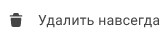

Удаленные контакты хранятся в корзине. 

Вы можете удалить только локальные контакты. Контакты адресной книги LDAP недоступны для редактирования и удаляются при удалении адресной книги.

# Как удалить отдельный контакт
1. Перейдите в раздел **Контакты**.
2. Выделите контакт в списке нажатием курсора.
3. В верхней панели нажмите на кнопку  .

#  Как удалить несколько контактов сразу

1. Перейдите в раздел **Контакты**.
2. Установите флажки слева от контактов.
3. В верхней панели нажмите на кнопку  .

# Как удалить все контакты 

1. Перейдите в раздел **Контакты**.
2. Выберите все контакты, установив флажок в левом верхнем углу. 
3. В верхней панели нажмите на кнопку .

# Как очистить корзину

1. Перейдите в раздел **Контакты**.
2. В левом боковом меню  выберите  **Корзина**.
3. Установите флажки напротив контактов, которые хотите навсегда удалить, и нажмите **Удалить навсегда**.

***Примечание:*** параметр **Удалить навсегда** доступен только в корзине. 

Чтобы удалить все контакты в корзине, нажмите кнопку  **Очистить корзину** , появляющуюся при наведении на папку **Корзина** на панели бокового меню.  
Или выделите все контакты в корзине и нажмите на кнопку **Удалить навсегда**  на панели действий.

**ИНСТРУКЦИИ ПО ТЕМЕ:**  
1. [Как восстановить удаленные контакты из корзины.](./restore-contacts.md)  
2. [Как удалить адресную книгу LDAP.](./delete-ldap.md)  