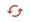
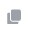
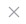
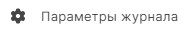
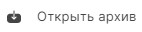

# Общее описание

Информация о событиях, происходящих в рамках приложения, записывается в журнал событий.  
Вы можете перейти в журнал двумя способами:
- выбрать в меню пункт **О программе**, раздел **Журнал событий**;
- нажать  в правой боковой панели списка уведомлений ().

События в журнале разделяются по уровням логирования:  **Информация** и **Ошибка**.   
**Информация** включает в себя все сообщения, информирующие о действиях, например, операция подписи, экспорт сертификата.  
**Ошибка** сообщает об ошибках в работе приложения.

Вы можете обновить события в журнале, нажав иконку , которая возникает при наведении на название раздела в левой боковой панели.

# Просмотр подробной информации события

Для просмотра подробной информации о событии выделите запись в списке журанала и нажмите иконку просмотра  .

В правой боковой панели отображается подробная информация.

Вы можете скопировать ее для отправки в техническую поддержку, нажав иконку .

# Сортировка и фильтрация

Вы можете сортировать список сообщений в журнале по любому из столбцов. По умолчанию журнал отсортирован по дате, начиная от последнего события.

Для фильтрации журнала используется строка поиска.  
Вы можете воспользоваться быстрым поиском по символьному совпадению, тогда в журнале остануться только записи, удовлетворяющие запросу.  
Для более детальной фильтрации вы можете задать параметры. Для этого в строке поиска нажмите иконку .  
Вы можете задать сдедующие параметры:
- **Дата** - диапазон дат;
- **Приложение** - раздел, в котором возникло событие;
 - **Уровень логирования**;
- **Содержит тескт** - ключевые слова в сообщении.
  
Фильтр применяется после нажатия на кнопку **Поиск** в параметрах.

Отменить примененный фильтр вы можете, нажав в строке поиска иконку .

# Настройки журнала

Вы можете настроить размер журанала и уровни логирования.

1. На панели действий нажмите кнопку .
2. В открывшейся новой вклдаке параметров журана задайте размер журнала и уровень логирования. Общие параметры, такие как имя, расположение, даты создания и изменения, недоступны для редактирования и являются информационными.
Максимальный размер журнала - 5 МБ.
3. Нажмите кнопку  для применения изменений.

При достижении максимального размера файла журнала создается новый журнал, без перезаписи старого. Старый журнал становится архивным.

Вы можете в параметрах журнала перейти к расположению файла событий, нажав на ссылку поля **Расположен**.

# Загрузка архивного журнала

Вы можете посмотреть события из архивного журнала.

1. На панели действий нажмите кнопку .
2. Укажите путь к файлу с архивным журналом.
   
Архивная копия открывается в новой вкладке.

